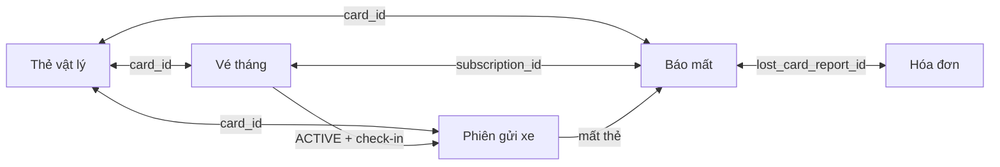

# Vòng đời thẻ, vé tháng và báo mất thẻ

> Cập nhật phân tích: 17/08/2026. Đã ghi nhận ba quyết định mentor xác nhận về checkout khi khóa, thu hồi thẻ tìm thấy và loại bỏ `DAMAGED`; tài liệu **chưa phải yêu cầu triển khai ngay**.

## 1. Mục tiêu và quyết định phạm vi

Ba trục trạng thái dưới đây phải được quản lý độc lập, nhưng mọi thao tác phải kiểm tra tính nhất quán chéo:

| Trục | Bản ghi nguồn | Trả lời câu hỏi |
|---|---|---|
| Thẻ vật lý | `access_control.cards` | Thẻ đang có thể quét/dùng hay đang ở kho/trong bãi/bị khóa/ngừng dùng? |
| Vé tháng (subscription) | `access_control.subscriptions` | Hồ sơ vé đang chờ duyệt/thanh toán/nhận thẻ hay còn hiệu lực? |
| Báo mất | `access_control.lost_card_reports` | Một sự cố mất thẻ có đang mở, đã giải quyết hay đã hủy? |

Quyết định cần áp dụng cho UI và API sau này:

1. Trang **Quản lý thẻ** chỉ còn các thao tác quản trị tồn kho: cập nhật thông tin, **Khóa/Mở khóa**, **Ngưng sử dụng**. Bỏ hoàn toàn nút/API công khai “Báo mất thẻ”.
2. “Báo hỏng” không còn là một nghiệp vụ độc lập. Nếu thẻ hỏng không thể dùng tiếp, nhân viên chọn **Ngưng sử dụng**, bắt buộc ghi lý do `Hỏng vật lý` (hoặc lý do khác). Không tạo mới trạng thái `DAMAGED`.
3. Mọi mất thẻ của khách hoặc sự cố mất khi xe đang trong bãi chỉ đi qua **Quản lý thẻ mất**. Luồng này mới được phép cập nhật đồng thời thẻ, vé tháng, phiên gửi xe và hóa đơn.
4. `BLOCKED` là lớp tạm thời. Khi mở khóa phải phục hồi đúng trạng thái trước khóa, sau khi kiểm tra các liên kết nền vẫn còn hợp lệ; **không được mặc định về `AVAILABLE`**.

## 2. Các trạng thái mục tiêu

### 2.1. Thẻ vật lý

| Trạng thái | Ý nghĩa | Có quét check-in? | Có chuyển trực tiếp từ màn Quản lý thẻ? |
|---|---|---:|---:|
| `AVAILABLE` | Trong kho, sẵn sàng cấp hoặc dùng làm thẻ lượt. | Có, với thẻ lượt | Không (do cấp/gỡ liên kết hoặc checkout tạo ra) |
| `RESERVED` | Đã giữ riêng cho một vé tháng `PENDING_PAYMENT`/`PENDING_CARD`. | Không | Không |
| `ASSIGNED` | Đã giao/gắn cho vé tháng `ACTIVE`, chưa có phiên gửi xe mở. | Có, nếu vé còn hiệu lực | Không |
| `IN_USE` | Gắn đúng một phiên gửi xe `OPEN`. | Không, vì đã có phiên mở | Không |
| `BLOCKED` | Tạm khóa do sự cố; giữ snapshot trạng thái trước khóa. | Không | Có: Khóa/Mở khóa |
| `LOST` | Thẻ mất, được tạo bởi hồ sơ báo mất. Không được dùng/cấp lại trực tiếp. | Không | Không |
| `RETIRED` | Ngừng vận hành vĩnh viễn (hỏng, thất lạc tồn kho đã xác minh, hết vòng đời...). | Không | Có: Ngưng sử dụng, nếu đủ điều kiện |

`DAMAGED` là trạng thái legacy của dữ liệu/mã hiện tại và sẽ được **loại bỏ hoàn toàn** khỏi enum, constraint database, API và UI sau migration. Migration chuyển mọi bản ghi `DAMAGED` sang `RETIRED`, bổ sung lý do chuẩn hóa `Hỏng vật lý (migrated)` cùng audit metadata. Trong giai đoạn triển khai migration, UI chỉ đọc và gắn nhãn “Ngừng sử dụng (lịch sử)”; sau cutover không còn filter/tab/giá trị `DAMAGED`.

### 2.2. Vé tháng (`SubscriptionStatus`)

| Trạng thái | Ý nghĩa | Liên hệ thẻ bắt buộc |
|---|---|---|
| `PENDING` | Khách tạo yêu cầu, chờ duyệt. | Không có `card_id` |
| `PENDING_PAYMENT` | Đã duyệt, đã giữ thẻ, chờ thanh toán. | Có một thẻ `RESERVED` |
| `PENDING_CARD` | Đã thanh toán, chờ khách nhận thẻ. | Có một thẻ `RESERVED` |
| `ACTIVE` | Vé đã hiệu lực và đã nhận thẻ. | Có thẻ `ASSIGNED` hoặc `IN_USE` |
| `EXPIRED` | Hết thời hạn vé. | Có thể vẫn tham chiếu thẻ `ASSIGNED`; không tự trả thẻ về kho |
| `CANCELLED` | Hủy trước luồng hoàn tiền (hiện áp dụng `PENDING`/`PENDING_PAYMENT`). | Không còn thẻ đã giữ nếu có |
| `REJECTED` | Từ chối lúc xét duyệt. | Không có `card_id` |

`EXPIRED` không đồng nghĩa thẻ đã được thu hồi. Thẻ vật lý vẫn có thể ở ngoài bãi với khách; chỉ đưa về `AVAILABLE` sau nghiệp vụ thu hồi/thay thế riêng, có xác nhận đã nhận lại thẻ. Đây là điểm cần giữ để không cấp trùng một thẻ đang ở ngoài thực tế.

### 2.3. Hồ sơ báo mất (`LostCardReportStatus`)

| Trạng thái | Ý nghĩa | Hóa đơn phí mất thẻ |
|---|---|---|
| `OPEN` | Sự cố đang xử lý; thẻ đã là `LOST`. | `UNPAID` hoặc `PAID` tùy thời điểm thanh toán |
| `RESOLVED` | Đã thu phí và hoàn tất hướng xử lý. | Phải `PAID` trước khi resolve |
| `CANCELLED` | Hủy vì tìm lại thẻ trước thanh toán hoặc nhập nhầm. | Hóa đơn phải được hủy, không có thanh toán thành công |

Ba context đang có là `VISITOR_IN_PARKING`, `REGISTERED_IN_PARKING`, `REGISTERED_OUTSIDE`. Đây là context của **sự cố**, không phải trạng thái thẻ.

## 3. Sơ đồ tổng quan và nguyên tắc bất biến



Các bất biến phải được backend kiểm tra trong cùng transaction:

1. Một thẻ chỉ có tối đa một phiên gửi xe `OPEN` và tối đa một báo mất `OPEN`.
2. Thẻ `IN_USE` phải có đúng một phiên `OPEN`; thẻ `RESERVED` phải gắn đúng một vé `PENDING_PAYMENT` hoặc `PENDING_CARD`; thẻ `ASSIGNED` phải có vé `ACTIVE` và không có phiên mở.
3. Không tạo báo mất trực tiếp bằng `PATCH /cards/{id}/status`. Phải xác định context, khóa bản ghi liên quan, tạo report/hóa đơn rồi mới đánh dấu thẻ `LOST`.
4. Không cho check-in bằng `BLOCKED`, `LOST` hoặc `RETIRED`; không cho cấp/giữ/gán các thẻ này.
5. `RETIRED` là kết thúc đối với thẻ vật lý. Thẻ `LOST` không được mở khóa/cấp lại trực tiếp; chỉ có thể đi qua workflow thu hồi và kiểm định thẻ tìm thấy sau khi report `RESOLVED`.
6. Mọi chuyển trạng thái phải ghi actor, thời điểm, lý do (nếu thao tác quản trị/sự cố) và audit log. Không dùng API cập nhật trạng thái tổng quát để bỏ qua quy tắc.

## 4. Ma trận chuyển trạng thái thẻ

| Từ | Sự kiện/use case duy nhất | Sang | Điều kiện chính | Hệ quả |
|---|---|---|---|---|
| `AVAILABLE` | Duyệt vé tháng | `RESERVED` | Có thẻ đăng ký còn trống | Vé thành `PENDING_PAYMENT` hoặc `PENDING_CARD` và gắn `card_id` |
| `RESERVED` | Hủy/timeout thanh toán | `AVAILABLE` | Vé chưa thanh toán và được hủy | Bỏ `card_id` trên vé |
| `RESERVED` | Xác nhận giao thẻ | `ASSIGNED` | Hóa đơn vé đã trả; vé `PENDING_CARD` | Vé thành `ACTIVE`, ghi ngày nhận thẻ |
| `AVAILABLE` | Check-in khách lượt | `IN_USE` | Thẻ là loại lượt, không có phiên mở | Tạo phiên `OPEN` |
| `ASSIGNED` | Check-in vé tháng | `IN_USE` | Vé `ACTIVE` trong hiệu lực, đúng xe/biển số | Tạo phiên `OPEN` |
| `IN_USE` (lượt) | Checkout thành công | `AVAILABLE` | Phiên được đóng/thanh toán theo quy định | Đóng phiên, giải phóng thẻ |
| `IN_USE` (vé tháng) | Checkout thành công | `ASSIGNED` | Phiên được đóng | Giữ liên kết vé/thẻ |
| `AVAILABLE` / `RESERVED` / `ASSIGNED` / `IN_USE` | Khóa | `BLOCKED` | Xem mục 5 | Lưu trạng thái trước khóa; chặn các thao tác bình thường |
| `BLOCKED` | Mở khóa | Trạng thái snapshot | Các liên kết nền còn khớp snapshot | Xóa metadata khóa |
| trạng thái hợp lệ | Tạo báo mất qua module chuyên biệt | `LOST` | Chỉ theo context ở mục 7 | Tạo report, hóa đơn và/hoặc cập nhật phiên |
| `LOST` | Thu hồi thẻ tìm thấy, kiểm định đạt | `AVAILABLE` | Report `RESOLVED`, không còn liên kết active và thẻ đạt kiểm định | Giữ nguyên lịch sử report/hóa đơn; thẻ có thể được cấp lại qua luồng thường |
| `LOST` | Thu hồi thẻ tìm thấy, kiểm định không đạt | `RETIRED` | Có kết luận kiểm định | Ghi lý do kết luận; giữ lịch sử sự cố |
| trạng thái không có usage đang hoạt động | Ngưng sử dụng | `RETIRED` | Không có phiên mở, vé giữ thẻ hoặc report mở | Lưu lý do (kể cả `Hỏng vật lý`) |

Không cho phép: `RETIRED` → bất kỳ trạng thái dùng được nào; `LOST → AVAILABLE` bằng API đổi trạng thái chung (chỉ workflow thu hồi, kiểm định đạt mới được phép); `BLOCKED` → `LOST`/`RETIRED` bằng API đổi trạng thái chung; `IN_USE` → `RETIRED`; `RESERVED`/`ASSIGNED` → `AVAILABLE` chỉ bằng một nút thủ công.

## 5. Luồng Khóa/Mở khóa có phục hồi trạng thái

### 5.1. Dữ liệu phải lưu

Thẻ bị khóa cần có tối thiểu:

```text
status = BLOCKED
status_before_blocked = AVAILABLE | RESERVED | ASSIGNED | IN_USE
blocked_at
blocked_by
blocked_reason
```

`status_before_blocked` là bắt buộc khi `status = BLOCKED`, và phải `NULL` ở các trạng thái khác. `blocked_by` nên được thêm rõ ràng thay vì chỉ suy luận từ audit chung, vì đây là dữ liệu vận hành hiển thị trong màn chi tiết. Một thẻ đã `BLOCKED` không được khóa lồng lần hai.

### 5.2. Khi khóa

| Snapshot | Cho phép? | Hành vi trong thời gian khóa |
|---|---:|---|
| `AVAILABLE` | Có | Không cho cấp/giữ/check-in. |
| `RESERVED` | Có | Giữ nguyên vé và thẻ đã reserve; không được giao thẻ, hủy/timeout vé vẫn được phép giải phóng theo luồng vé tháng. |
| `ASSIGNED` | Có | Giữ nguyên vé `ACTIVE`; chặn check-in. |
| `IN_USE` | Có, chỉ quyền quản lý vận hành | Giữ phiên `OPEN`; chặn quét checkout tự động. Nhân viên phải mở khóa trước khi checkout hoặc chuyển sang luồng báo mất/manual exception có ghi nhận. |
| `LOST`, `RETIRED`, legacy `DAMAGED` | Không | Không phải đối tượng của khóa tạm thời. |

**Quyết định mentor xác nhận:** khi xe đang trong bãi, checkout tự động bị chặn; nhân viên phải **mở khóa và khôi phục `IN_USE` trước khi checkout**. Modal khóa phải cảnh báo rõ nguy cơ chặn xe ra và yêu cầu xác nhận tăng cường. Nếu lý do thực tế là mất thẻ, nhân viên phải hủy thao tác khóa và dùng Quản lý thẻ mất.

### 5.3. Khi mở khóa

Backend không được tin snapshot một cách mù quáng. Khóa bản ghi thẻ và kiểm tra trước khi phục hồi:

| Snapshot cần phục hồi | Điều kiện phải còn đúng | Nếu không đúng |
|---|---|---|
| `AVAILABLE` | Không có vé giữ/gán đang hoạt động, không phiên `OPEN`, không report `OPEN`. | Từ chối mở khóa và hướng dẫn xử lý liên kết bất thường. |
| `RESERVED` | Có đúng một vé `PENDING_PAYMENT` hoặc `PENDING_CARD` tham chiếu thẻ. | Từ chối mở khóa; không tự đưa về kho. |
| `ASSIGNED` | Có vé `ACTIVE` tham chiếu thẻ và không có phiên `OPEN`. | Từ chối mở khóa. |
| `IN_USE` | Có đúng một phiên `OPEN` tham chiếu thẻ; nếu phiên đăng ký, vé cũng phải `ACTIVE` trong hiệu lực. | Từ chối mở khóa. |

Khi thành công, chỉ cập nhật `status = status_before_blocked`, sau đó xóa `status_before_blocked`, `blocked_at`, `blocked_by`, `blocked_reason`. Nếu trong thời gian khóa phát hiện mất thẻ, Quản lý thẻ mất là luồng duy nhất được quyền thay `BLOCKED` bằng `LOST`; snapshot khóa bị xóa và không còn hiệu lực.

## 6. Luồng vé tháng và ảnh hưởng đến thẻ

```mermaid
stateDiagram-v2
    [*] --> PENDING
    PENDING --> PENDING_PAYMENT: duyệt + giữ thẻ RESERVED
    PENDING --> PENDING_CARD: duyệt vé miễn phí + giữ thẻ RESERVED
    PENDING --> REJECTED: từ chối / quá hạn duyệt
    PENDING --> CANCELLED: hủy
    PENDING_PAYMENT --> PENDING_CARD: thanh toán thành công
    PENDING_PAYMENT --> CANCELLED: hủy hoặc timeout; trả thẻ AVAILABLE
    PENDING_CARD --> ACTIVE: giao thẻ; RESERVED -> ASSIGNED
    ACTIVE --> EXPIRED: qua effective_to
```

Hệ quả nghiệp vụ cần thể hiện rõ:

| Sự kiện vé tháng | Vé tháng | Thẻ |
|---|---|---|
| Tạo yêu cầu | `PENDING` | Không chiếm thẻ |
| Duyệt | `PENDING_PAYMENT` (hoặc `PENDING_CARD` nếu miễn phí) | `AVAILABLE → RESERVED` |
| Thanh toán | `PENDING_PAYMENT → PENDING_CARD` | Vẫn `RESERVED` |
| Giao thẻ | `PENDING_CARD → ACTIVE` | `RESERVED → ASSIGNED` |
| Khách check-in/check-out | Vẫn `ACTIVE` | `ASSIGNED ↔ IN_USE` |
| Hủy/timeout trước thanh toán | `→ CANCELLED` | `RESERVED → AVAILABLE`, gỡ `card_id` |
| Vé hết hạn | `ACTIVE → EXPIRED` | Không tự giải phóng thẻ; chờ thu hồi thực tế |

## 7. Luồng Quản lý thẻ mất

Trang này là nơi duy nhất tạo report. Nhân viên tra cứu theo biển số hoặc hồ sơ; hệ thống tự xác định context, không cho UI tự gửi tùy ý `card_id`/trạng thái.

| Context | Điều kiện vào | Khi tạo report `OPEN` | Khi resolve sau `PAID` | Khi cancel trước thanh toán |
|---|---|---|---|---|
| `VISITOR_IN_PARKING` | Có phiên khách lượt `OPEN` | Phiên `OPEN → LOST_CARD`; thẻ `IN_USE → LOST`; tạo hóa đơn tiền gửi + phí mất | Đóng phiên, mở barrier; không cấp thẻ thay thế | Hủy hóa đơn; phiên về `OPEN`; thẻ về `IN_USE` |
| `REGISTERED_IN_PARKING` | Có phiên đăng ký `OPEN`, vé `ACTIVE` | Phiên `OPEN → LOST_CARD`; thẻ `IN_USE → LOST`; tạo hóa đơn phí mất | Bắt buộc chọn thẻ thay thế `AVAILABLE` cùng loại; thẻ mới `→ ASSIGNED`, cập nhật `subscription.card_id`, đóng phiên, mở barrier | Hủy hóa đơn; phiên về `OPEN`; thẻ cũ về `IN_USE` |
| `REGISTERED_OUTSIDE` | Không có phiên mở, vé `ACTIVE` | Thẻ `ASSIGNED → LOST`; tạo hóa đơn phí mất | Bắt buộc thẻ thay thế `AVAILABLE` cùng loại; thẻ mới `→ ASSIGNED`, cập nhật `subscription.card_id` | Hủy hóa đơn; thẻ cũ về `ASSIGNED` |

Sau `RESOLVED`, thẻ cũ vẫn `LOST`; không được hoàn nguyên bằng thao tác đổi trạng thái nhanh. **Quyết định mentor xác nhận** là cho phép thu hồi, kiểm định và tái cấp, không cần bước phê duyệt. Workflow đề xuất:

1. Nhân viên thu hồi thẻ, ghi nhận thẻ đã được trả về và kết quả kiểm tra UID/RFID, ngoại quan, khả năng quét.
2. Hệ thống chỉ cho ghi nhận kiểm định khi report liên quan là `RESOLVED`, không còn report/phiên `OPEN`, và subscription đang hoạt động không còn tham chiếu thẻ cũ (đã dùng thẻ thay thế hoặc vé đã kết thúc).
3. Lưu người kiểm định, thời điểm, checklist/kết quả và ghi audit log; không tạo `operations.approval_requests` và không đảo ngược report, hóa đơn hoặc thanh toán đã hoàn tất.
4. Nếu thẻ đạt kiểm định: `LOST → AVAILABLE`; thẻ chỉ được cấp lại qua luồng cấp/giữ thẻ thông thường. Nếu không đạt: `LOST → RETIRED`, ghi lý do.

Luồng này giữ nguyên lịch sử mất thẻ và doanh thu, đồng thời cho phép tái sử dụng vật lý khi đã kiểm soát rủi ro.

### Lưu ý về mất thẻ trong kho hoặc thẻ `RESERVED`

Ba context hiện có chỉ phục vụ mất thẻ của khách (đang trong bãi hoặc có vé `ACTIVE`). Một thẻ trong kho `AVAILABLE` bị thất lạc, hoặc thẻ `RESERVED` chưa giao nhưng nội bộ làm mất, **không nên giả là báo mất của khách** và cũng không được dùng nút đổi trạng thái trực tiếp. Cần thống nhất thêm một nghiệp vụ “Điều chỉnh tồn kho thẻ” có phê duyệt; kết quả vật lý là `RETIRED` với lý do `Thất lạc tồn kho` hoặc thay thẻ reserved theo luồng vé tháng. Đây là khoảng trống chức năng cần mentor xác nhận.

## 8. Hành vi UI/UX sau quyết định

### Trang Quản lý thẻ

- Menu tác vụ: `Khóa thẻ`/`Mở khóa thẻ`, `Ngưng sử dụng`; không hiển thị `Báo mất thẻ`, `Báo hỏng`.
- “Ngưng sử dụng” bắt buộc chọn lý do chuẩn hóa: `Hỏng vật lý`, `Không còn sử dụng`, `Thất lạc tồn kho đã xác minh`, `Khác` + mô tả. Với bất kỳ liên kết active nào, nút bị disable và giải thích lý do.
- Thẻ `BLOCKED` hiển thị: trạng thái trước khóa, người khóa, thời điểm, lý do. Mở khóa phải qua modal xác nhận, hiển thị trạng thái sẽ phục hồi.
- Cột “Báo mất” vẫn là thông tin liên quan (report mới nhất/open), nhưng không phải nút thao tác. Điều hướng sang chi tiết báo mất nếu report tồn tại.
- Trong giai đoạn migration, legacy `DAMAGED` chỉ đọc và gộp dưới “Ngừng sử dụng (lịch sử)”; sau cutover loại khỏi toàn bộ tab, filter và payload.

### Trang Quản lý thẻ mất

- Là điểm vào duy nhất cho sự cố mất của khách; tạo report từ kết quả tra cứu và hiển thị rõ context, phiên, vé, phí và hóa đơn.
- Với report `OPEN`: cho thanh toán, hủy khi chưa thanh toán, hoặc resolve sau khi thanh toán. Không cho tạo report thứ hai trên cùng thẻ/phiên.
- Với `REGISTERED_*`: trước resolve chỉ cho chọn thẻ thay thế `AVAILABLE`, cùng `card_type_id`.

### Migration loại bỏ `DAMAGED` (đã được xác nhận)

Migration phải triển khai theo thứ tự an toàn, trong một release có kiểm soát:

1. Bổ sung dữ liệu ngừng sử dụng cần thiết (`retired_at`, `retired_by`, `retired_reason`) hoặc bảo đảm audit log hiện có lưu được đầy đủ lý do chuyển đổi.
2. Chuyển toàn bộ `cards.status = DAMAGED` thành `RETIRED`, với lý do `Hỏng vật lý (migrated)` và actor/thời điểm migration; đối soát số lượng trước và sau.
3. Cập nhật constraint/status enum ở database, model backend, API contract, test fixture và frontend để chỉ còn các trạng thái mục tiêu; xóa action/filter/badge `DAMAGED`.
4. Chạy kiểm tra hậu migration: không còn `DAMAGED`, không có thẻ `RETIRED` gắn phiên/report mở, và dữ liệu lịch sử audit vẫn truy vết được.

Không thực hiện migration này như một thay đổi UI đơn lẻ; cần backup, kế hoạch rollback và kiểm thử trên bản sao dữ liệu trước khi chạy production.

## 9. Đánh giá hiện trạng và khoảng cách cần khắc phục

| Hiện trạng đã kiểm tra | Rủi ro | Hướng mục tiêu |
|---|---|---|
| Màn Quản lý thẻ có menu `Báo mất thẻ` và `Báo hỏng`, gọi API status chung. | Có thể tạo `LOST` không có report/hóa đơn/phiên; `DAMAGED` phân mảnh nghĩa ngưng dùng. | Gỡ hai action và chặn các target này ở API quản trị chung. |
| `PATCH /cards/{id}/status` đang cho `LOST`, `DAMAGED`, `RETIRED`; `CardPolicy.unblock` luôn về `AVAILABLE`. | Phá vòng đời vé/phiên và làm mất trạng thái trước khóa. | Tách command use case: block, unblock, retire; chỉ lost/recovery workflow được chuyển `LOST`; loại `DAMAGED`. |
| Bảng `cards` chỉ có `blocked_at`, `blocked_reason`. | Không đủ dữ liệu để khôi phục đúng `RESERVED`/`ASSIGNED`/`IN_USE`; chưa biết người khóa. | Thêm `status_before_blocked`, `blocked_by` và constraint nhất quán. |
| Lost-card workflow hiện đã xử lý 3 context, invoice, resolve/cancel và thẻ thay thế. | Đây là luồng đúng nhưng cần là điểm vào duy nhất. | Giữ và tăng validation từ `BLOCKED`/trạng thái liên kết khi áp dụng luồng mới. |
| File schema gốc chưa phản ánh đầy đủ các migration đã có (`RESERVED`, `PENDING_*`, context/cancel fields của report). | Môi trường khởi tạo mới có thể khác DB chạy migration. | Đồng bộ schema baseline với migration trước khi phát triển tiếp. |
| Vé `EXPIRED` hiện không giải phóng card tự động. | Nếu vô tình auto-release, có thể cấp trùng thẻ vật lý. | Giữ nguyên; bổ sung workflow thu hồi thẻ khi có yêu cầu. |

## 10. Quy tắc API, phân quyền và dữ liệu đề xuất

Đây là thiết kế định hướng, không yêu cầu giữ nguyên tên endpoint:

| Command | Quyền gợi ý | Đích hợp lệ |
|---|---|---|
| Khóa thẻ | `CARD_UPDATE_ALL` hoặc quyền `CARD_BLOCK_ALL` tách riêng | `AVAILABLE`, `RESERVED`, `ASSIGNED`, `IN_USE` |
| Mở khóa | tương tự khóa | Chỉ `BLOCKED`, kiểm tra snapshot |
| Ngưng sử dụng | `CARD_DELETE_ALL`/`CARD_RETIRE_ALL` | Không có phiên, giữ thẻ, report mở |
| Tạo/Hủy/Resolve báo mất | quyền `LOST_CARD_REPORT_*` hiện có | Chỉ qua context hợp lệ |
| Giao/trả thẻ vé tháng | `SUBSCRIPTION_ASSIGN_CARD_ALL` và workflow thu hồi riêng | Theo lifecycle vé |

Response cho màn thẻ nên trả thêm `statusBeforeBlocked`, `blockedBy`, `blockedAt`, `blockedReason` và thông tin report mở gần nhất (nếu có) để UI không suy diễn “báo mất mở” chỉ từ `card.status = LOST`.

## 11. Kịch bản kiểm thử/acceptance để báo cáo

1. Khóa thẻ `ASSIGNED` có vé `ACTIVE` rồi mở khóa: thẻ phải quay lại `ASSIGNED`, không thành `AVAILABLE`; check-in được lại.
2. Khóa thẻ `RESERVED` rồi vé timeout: workflow timeout được phép hủy vé/gỡ thẻ; sau đó mở khóa phải bị từ chối vì snapshot `RESERVED` không còn liên kết hợp lệ.
3. Khóa thẻ `IN_USE`: checkout tự động bị chặn; bắt buộc mở khóa khôi phục `IN_USE` rồi mới checkout. Sau checkout, thẻ lượt về `AVAILABLE`, thẻ vé tháng về `ASSIGNED`.
4. Báo mất khách lượt trong bãi: phải có report `OPEN`, invoice và phiên `LOST_CARD`; không tạo được report thứ hai.
5. Hủy report chưa thanh toán: invoice `CANCELLED`, phiên/thẻ khôi phục đúng context; report thành `CANCELLED`.
6. Resolve report vé tháng ngoài bãi: từ chối nếu chưa thanh toán hoặc thẻ thay thế khác loại/không `AVAILABLE`; khi hợp lệ, chỉ thẻ mới gắn vào vé.
7. Chọn “Hỏng vật lý” ở màn thẻ: thẻ thành `RETIRED`, có lý do/audit; không phát sinh `DAMAGED`.
8. Migration dữ liệu: không còn bản ghi `DAMAGED`; enum, database constraint, API contract và UI không còn giá trị này.
9. Thẻ được tìm thấy sau report `RESOLVED`: chỉ có thể `LOST → AVAILABLE` sau kiểm định đạt; report/hóa đơn/thanh toán cũ không đổi. Không đạt phải `LOST → RETIRED`.
10. Không có đường UI/API status chung nào đưa thẻ sang `LOST`; chuyển `LOST` chỉ do workflow báo mất hoặc workflow thu hồi đã kiểm định.

## 12. Quyết định đã xác nhận và điểm còn mở

Đã xác nhận:

1. Thẻ `IN_USE` bị khóa phải mở khóa trước checkout; không triển khai checkout ngoại lệ.
2. Thẻ cũ tìm thấy sau report `RESOLVED` được kiểm định và tái cấp qua workflow vận hành, không cần phê duyệt.
3. Loại hẳn `DAMAGED` khỏi enum/database sau migration dữ liệu.

Điểm còn cần chốt phạm vi:

1. Có cần bổ sung workflow chính thức **thu hồi thẻ sau vé hết hạn** và **điều chỉnh tồn kho thẻ thất lạc** trong phạm vi hiện tại không?
