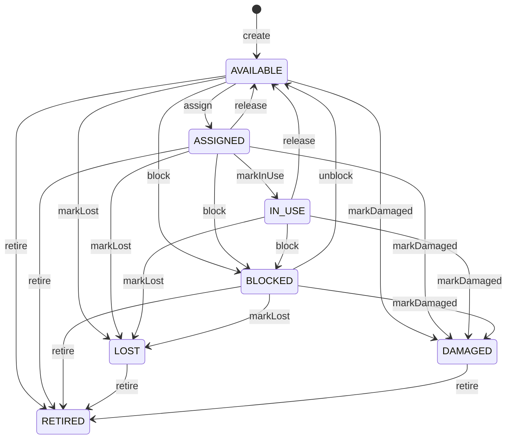

# Clean Architecture Guide

## 1. Purpose

This document defines the architecture guide for backend modules in `vehicle-management`, based on the actual PostgreSQL schema in `vehicle_management.sql`.

Use this file for:

- deciding module boundaries
- deciding layer responsibilities
- deciding when a module can stay lightweight
- deciding when domain models are required
- deciding when ports and adapters are needed

For code-level conventions, also read:

- `docs/backend-coding-standard.md`

## 2. Architecture goal

The goal is not to create unnecessary layers.

The goal is to separate:

- delivery concerns
- business concerns
- persistence concerns
- integration concerns

## 3. Current business module map from the schema

The database already groups the system by business schemas.
The architecture should follow those boundaries whenever practical.

### IAM

Tables:

- `iam.roles`
- `iam.permissions`
- `iam.accounts`
- `iam.role_permissions`
- `iam.refresh_tokens`
- `iam.login_attempts`
- `iam.account_status_history`

Main concern:

- authentication
- authorization
- account state
- login lifecycle

### People

Tables:

- `people.user_profiles`
- `people.customers`
- `people.employees`
- `people.customer_vehicles`

Main concern:

- personal profile
- customer-specific business data
- employee-specific business data
- customer-owned vehicles
- customer approval workflow and customer operational active or inactive lifecycle as separate concerns

### Catalog

Tables:

- `catalog.vehicle_types`
- `catalog.ticket_types`
- `catalog.card_types`
- `catalog.price_plans`
- `catalog.price_rules`
- `catalog.holiday_calendar`

Main concern:

- lookup catalogs
- pricing configuration

### Access control

Tables:

- `access_control.cards`
- `access_control.subscriptions`
- `access_control.lost_card_reports`

Main concern:

- physical card lifecycle
- subscription and registered ticket lifecycle
- lost card reporting and handling

### Parking

Tables:

- `parking.parking_lots`
- `parking.zones`
- `parking.parking_spaces`
- `parking.lanes`
- `parking.parking_sessions`
- `parking.parking_events`

Main concern:

- parking topology
- ingress and egress
- real parking sessions
- camera and lane events

### Billing

Tables:

- `billing.invoices`
- `billing.payments`

Main concern:

- invoice lifecycle
- payment recording

### Operations

Tables:

- `operations.shifts`
- `operations.shift_assignments`
- `operations.approval_requests`
- `operations.support_tickets`

Main concern:

- shift operations
- operational approval
- support workflows

### Hardware

Tables:

- `hardware.devices`

Main concern:

- physical device registry
- heartbeat and operational status

### Notification

Tables:

- `notification.notifications`

Main concern:

- outbound notification workflow

### Audit

Tables:

- `audit.audit_logs`

Main concern:

- cross-module auditing and traceability

## 4. Layer responsibilities

### Controller

Responsible for:

- HTTP request and response
- request validation trigger
- calling application use case
- schema-first delivery package organization in `entrypoint.controller.<schema>`
- using request and response DTOs from `entrypoint.dto.<schema>.<table>.request` and `entrypoint.dto.<schema>.<table>.response`

Must not contain:

- business rules
- repository logic
- persistence details

Package note:

- keep controllers grouped by schema under `entrypoint.controller`
- keep API DTOs grouped by schema under `entrypoint.dto`
- do not nest DTO packages inside controller packages

### Application

Responsible for:

- use case orchestration
- transaction boundary
- coordination across ports
- invoking domain models and domain services
- authorization checks at use case level

### Domain

Responsible for:

- business rules
- invariants
- policies
- state transitions
- domain services
- domain models

### Infrastructure

Responsible for:

- persistence adapters
- JPA repositories and entities
- security integration
- storage integration
- external services

## 5. Preferred flow

For non-trivial modules:

Controller
-> Request DTO
-> Application use case
-> Domain model or domain service
-> Output port
-> Infrastructure adapter
-> Persistence

In this repository, the delivery layer package layout should normally look like:

- `entrypoint.controller.<schema>`
- `entrypoint.dto.<schema>.<table>.request`
- `entrypoint.dto.<schema>.<table>.response`

## 6. Which modules can stay lightweight

The following parts are mostly configuration-oriented and can usually stay lightweight if the task is simple CRUD:

- `catalog.vehicle_types`
- `catalog.ticket_types`
- `catalog.card_types`
- `catalog.holiday_calendar`
- simple maintenance on `parking.parking_lots`, `parking.zones`, `parking.parking_spaces`, `parking.lanes`
- simple maintenance on `hardware.devices`

Typical structure for these:

- controller
- application use case
- persistence adapter

Rich domain modeling is not mandatory unless new complex rules appear.

## 7. Which modules should be treated as non-trivial

The following areas should not collapse into one CRUD-style service:

- `iam.accounts`, `iam.roles`, `iam.permissions`, `iam.role_permissions`
- `access_control.cards`
- `access_control.subscriptions`
- `access_control.lost_card_reports`
- `parking.parking_sessions`
- `parking.parking_events`
- `billing.invoices`
- `billing.payments`
- `operations.shifts`
- `operations.approval_requests`

These modules contain or are expected to contain:

- business state transitions
- approval logic
- pricing logic
- operational control
- audit-sensitive behavior

## 8. Domain-driven guidance for important flows

### 8.1. IAM and authorization

This schema currently models role-based authorization through:

- `iam.roles`
- `iam.permissions`
- `iam.role_permissions`
- `iam.accounts`

Architecture implication:

- permission resolution is not trivial enough to be scattered
- keep authorization logic centralized
- do not invent account-level permission override logic unless the schema changes

Good candidates:

- `AuthorizationProfile`
- `PermissionResolver`
- `AccountStatusPolicy`

### 8.2. Card lifecycle

`access_control.cards` is not a trivial lookup.

Its status values already imply lifecycle:

- `AVAILABLE`
- `ASSIGNED`
- `IN_USE`
- `LOST`
- `BLOCKED`
- `DAMAGED`
- `RETIRED`

Architecture implication:

- card assignment
- card blocking
- lost-card transition
- retirement

should live in domain logic, not in controllers.

Current state machine for `access_control.cards`:

Practical interpretation:

- `AVAILABLE` means the card is ready to be assigned or reused.
- `ASSIGNED` means the card has been issued but is not yet actively used in an operational parking flow.
- `IN_USE` means the card is currently participating in an active operational flow and must not be retired directly.
- `BLOCKED` is a temporary control state and can return to `AVAILABLE`.
- `LOST` and `DAMAGED` describe problem states, while `RETIRED` is the terminal lifecycle state that permanently removes the card from normal operation.
- `DAMAGED` and `RETIRED` must stay separate because `DAMAGED` explains the condition of the card, while `RETIRED` records the lifecycle decision to stop using it permanently.

Implementation notes for the current codebase:

- `delete` on cards should map to `RETIRED`, not hard delete by default.
- `retire` must be blocked when the card is still in active business flow such as open parking session, active subscription, or open lost-card report.
- `ASSIGNED` and `IN_USE` are lifecycle transitions and should not be mixed into a generic metadata update request.

### 8.3. Subscription lifecycle

`access_control.subscriptions` connects:

- customer
- customer vehicle
- card
- ticket type
- price rule
- approval
- validity period

Architecture implication:

- creation, approval, activation, expiry, rejection, cancellation

should be modeled as a business flow.

This module deserves:

- use cases
- domain validation
- repository ports

### 8.4. Parking session flow

`parking.parking_sessions` and `parking.parking_events` are core operational aggregates.

Important concerns:

- check-in
- check-out
- lost-card escalation
- session closing
- event recording
- captured plate evidence
- lane actor tracking

Architecture implication:

- do not implement this as plain insert/update endpoints
- use dedicated check-in and check-out use cases
- keep pricing and session state rules in domain or domain-supporting application use cases

### 8.5. Billing flow

`billing.invoices` and `billing.payments` are separate business concerns.

Architecture implication:

- invoice generation
- payment capture
- invoice paid-state transition
- refund or cancellation handling

must not be buried inside controller or repository logic.

### 8.6. Shift and approval flow

`operations.shifts`, `operations.shift_assignments`, and `operations.approval_requests` are operational workflows.

Architecture implication:

- opening and closing shifts
- assigning employees
- approving subscriptions or other target records

should be implemented as explicit use cases.

## 9. Ports

Use ports when:

- you want application independent from infrastructure
- you want easier testing
- you want easier substitution of persistence or integrations

Typical ports in this project:

- `CurrentUserPort`
- `AccountRepositoryPort`
- `RoleRepositoryPort`
- `PermissionRepositoryPort`
- `UserProfileRepositoryPort`
- `CustomerRepositoryPort`
- `EmployeeRepositoryPort`
- `CardRepositoryPort`
- `SubscriptionRepositoryPort`
- `LostCardReportRepositoryPort`
- `ParkingSessionRepositoryPort`
- `ParkingEventRepositoryPort`
- `InvoiceRepositoryPort`
- `PaymentRepositoryPort`
- `ShiftRepositoryPort`
- `ApprovalRequestRepositoryPort`
- `NotificationPort`
- `AuditLogPort`

## 10. Adapters

Adapters implement ports.

Examples:

- `CurrentUserSecurityAdapter`
- `AccountPersistenceAdapter`
- `SubscriptionPersistenceAdapter`
- `ParkingSessionPersistenceAdapter`
- `AuditLogPersistenceAdapter`

Do not create one identical adapter per feature if the behavior is shared.

Persistence package note for this repository:

- JPA entities live under `infrastructure.persistence.database.entity.<schema>`
- Spring Data repositories live under `infrastructure.persistence.database.repository.<schema>`
- JPA specification builders live under `infrastructure.persistence.database.specification.<schema>`
- persistence adapters live under `infrastructure.persistence.adapter.<schema>`
- Specification folders should contain real specification classes only. Do not add placeholder files purely to keep empty schema folders in version control.

## 11. Domain model versus entity boundary

Keep these distinct:

- request and response DTOs
- domain models
- persistence entities

JPA entities belong to persistence.
Domain models belong to business behavior.

Do not put complex session, subscription, or authorization rules directly into persistence entities.

## 12. PostgreSQL-specific architecture alignment

The architecture must respect the actual PostgreSQL design:

- UUID-based identifiers
- `TIMESTAMPTZ` semantics
- `CITEXT` intent for account email
- `JSONB` for flexible device config and audit snapshots
- trigger-driven `updated_at` maintenance in the schema

Application and infrastructure design should not fight these database decisions.

## 13. Practical guidance for this repository

Apply architecture proportionally:

- do not over-engineer simple catalog CRUD
- do not under-engineer parking, access-control, billing, and IAM flows

When in doubt:

1. read the nearest schema section in `vehicle_management.sql`
2. identify whether the table models state or just metadata
3. if it models state, prefer explicit use cases and domain rules

## 14. How to use this file with the coding standard

When starting a module:

1. Read this file to choose the right module shape
2. Read `docs/backend-coding-standard.md` to apply naming, mapping, entity, repository, and testing conventions

If there is conflict:

- architecture decisions follow `docs/clean-architecture-guide.md`
- code-level conventions follow `docs/backend-coding-standard.md`
