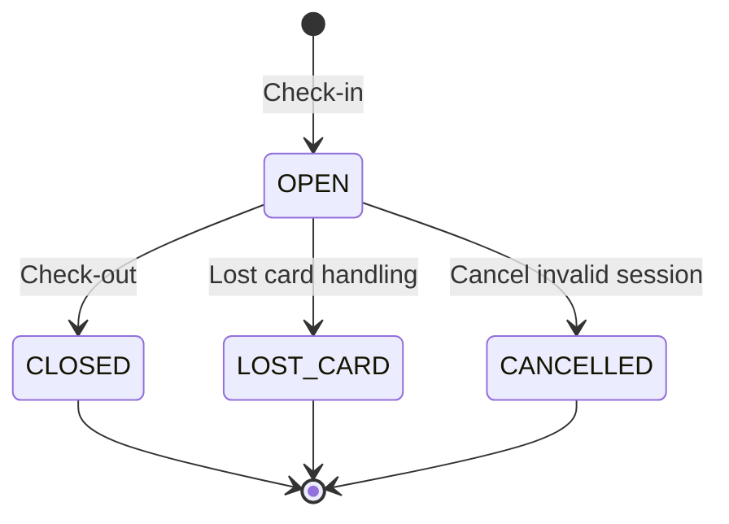
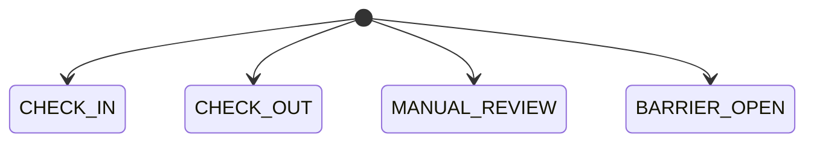
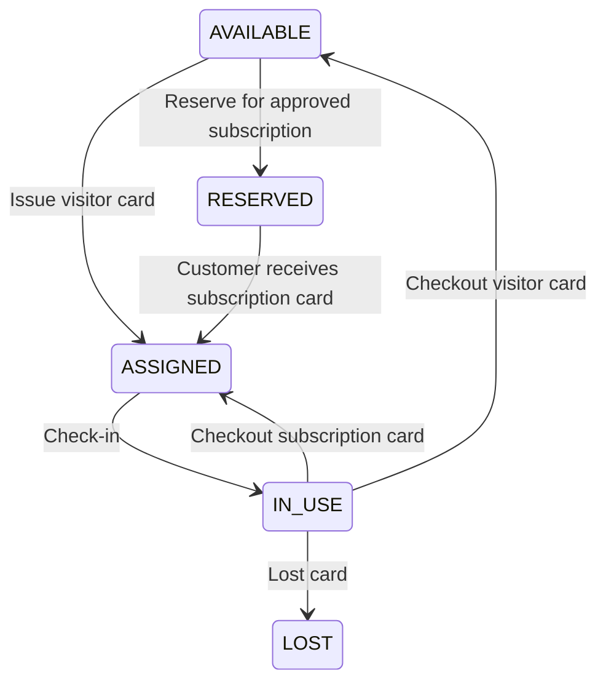

# Chuc nang tiep theo: Parking Session Check-in/Check-out

Ngay lap: 11-06-2026
Cap nhat trang thai: 2026-06-21

Tai lieu nay la ban dac ta va ke hoach implementation cho feature **Parking Session Check-in/Check-out** sau khi repo da co them account provisioning, avatar, subscription, invoice/payment va parking topology CRUD. Goc nhin ket hop PM, BA va senior backend: day la flow van hanh loi cua bai xe, khong nen lam nhu CRUD tren `parking.parking_sessions` va `parking.parking_events`.

## 1. Ket luan senior

Feature nen lam tiep theo la **Parking Session Check-in/Check-out**, tuc quan ly phien gui xe tu luc xe vao cong den luc xe ra cong.

Ly do chon feature nay:

- Schema da co `parking.parking_sessions` va `parking.parking_events`.
- Code da co domain model, policy, entity, repository va mapper skeleton cho parking session/event.
- Role/permission trong migration da seed ro cho `PARKING_MANAGER`, `EMPLOYEE`, `CUSTOMER`.
- Module parking topology da co controller cho parking lot, zone, gate, lane.
- Day la flow noi cac module da co: card, customer vehicle, subscription, price rule, invoice/payment, lost card, parking event.

Huong chot:

- `parking.parking_sessions` la aggregate chinh cho mot lan gui xe.
- `parking.parking_events` la event log theo session, dung cho check-in, check-out, manual review va barrier open.
- `EMPLOYEE` la nguoi thao tac check-in/check-out hang ngay.
- `PARKING_MANAGER` quan ly, xem, loc va xu ly cac case ngoai le nhu manual review/cancel.
- `CUSTOMER` chi xem lich su cua minh.
- `SYSTEM_ADMIN` khong van hanh bai xe.
- MVP nen lam visitor check-in/check-out truoc, sau do noi subscription va billing theo phase ro rang.

## 2. Boi canh da ra soat

### 2.1. Role va permission hien tai

Ma tran dua tren migration `V3__split_modules_actions_scopes.sql`, `V10__seed_role_permission_management_permissions.sql` va permission command bo sung cho check-flow.

| Role | Quyen lien quan parking | Dien giai nghiep vu |
|---|---|---|
| `SYSTEM_ADMIN` | Khong co `PARKING_SESSION_*`, `PARKING_EVENT_*` | Quan tri account, role, permission, audit. Khong thao tac cong xe. |
| `PARKING_MANAGER` | `PARKING_SESSION_READ_ALL`, `PARKING_SESSION_UPDATE_ALL`, `PARKING_SESSION_DELETE_ALL`, `PARKING_EVENT_READ_ALL`, `PARKING_EVENT_UPDATE_ALL`, `PARKING_EVENT_DELETE_ALL`, kem full quyen customer/card/catalog | Quan ly van hanh bai xe, xem report, xu ly case loi, cancel/manual review; khong check-in/check-out hang ngay. |
| `EMPLOYEE` | `PARKING_SESSION_CHECK_IN_ALL`, `PARKING_SESSION_READ_ALL`, `PARKING_SESSION_UPDATE_ALL`, `PARKING_EVENT_READ_ALL`, `PARKING_EVENT_UPDATE_ALL`, kem `CARD_READ_ALL`, `CUSTOMER_READ_ALL`, `CUSTOMER_VEHICLE_READ_ALL`, `VEHICLE_TYPE_READ_ALL`, `TICKET_TYPE_READ_ALL` | Nhan vien cong/quay thuc hien check-in, check-out, manual review co gioi han. |
| `CUSTOMER` | `PARKING_SESSION_READ_OWN`, `PARKING_EVENT_READ_OWN` | Xem lich su gui xe va su kien cua chinh minh. |

Nhan dinh:

- Permission check-in da tach khoi CRUD: `PARKING_SESSION_CHECK_IN_ALL` la command permission cho workflow check-in.
- Event `CHECK_IN` la side effect noi bo cua check-in use case; caller khong can `PARKING_EVENT_CREATE_ALL` chi de check-in.
- `DELETE` tren session/event khong nen la hard delete trong MVP, du permission co ton tai. Session/event la audit-sensitive, nen dung `cancel`/manual adjustment thay vi xoa.
- Invoice/payment module hien da co application guard (`INVOICE_*`, `PAYMENT_*`) va controller/use case rieng, nhung parking checkout chua goi billing port. Khong ep billing vao MVP visitor neu chua chot thu tien/receipt UX.

### 2.2. Schema lien quan

| Bang | Vai tro trong feature |
|---|---|
| `parking.parking_sessions` | Phien gui xe tu check-in den check-out. |
| `parking.parking_events` | Event log cua session: `CHECK_IN`, `CHECK_OUT`, `MANUAL_REVIEW`, `BARRIER_OPEN`. |
| `parking.parking_lots` | Bai xe, trang thai operation. |
| `parking.zones` | Khu trong bai, suc chua va loai xe duoc nhan. |
| `parking.gates` | Cong thuoc zone sau migration V7. |
| `parking.lanes` | Lan vao/ra, direction hien tai theo migration V8/code la `IN`, `OUT`; khong con `BOTH`. |
| `access_control.cards` | The vat ly dung de mo session va track xe trong bai. |
| `access_control.subscriptions` | Ve thang/ve dang ky, dung de nhan dien customer da co quyen gui xe theo goi. |
| `people.customers` | Customer business record. |
| `people.customer_vehicles` | Xe da dang ky cua customer. |
| `catalog.vehicle_types` | Loai xe de validate zone/lane va tinh gia. |
| `catalog.price_rules` | Cau hinh gia theo loai xe/thoi gian, dung khi checkout ve luot. |
| `billing.invoices` | Hoa don da co module rieng; checkout visitor co the noi sau MVP visitor neu can thu/ghi hoa don. |
| `billing.payments` | Giao dich thanh toan da co module rieng; record payment nen qua billing use case/port, khong nhung vao controller parking. |
| `access_control.lost_card_reports` | Xu ly mat the, nen lam phase rieng sau MVP check-in/out. |

### 2.3. Hien trang code

Da co:

- `domain.parking.parkingsession.model.ParkingSession`.
- `domain.parking.parkingsession.policy.ParkingSessionPolicy`.
- `domain.parking.parkingevent.model.ParkingEvent`.
- `domain.parking.parkingevent.policy.ParkingEventPolicy`.
- `infrastructure.persistence.database.entity.parking.ParkingSessionEntity`.
- `infrastructure.persistence.database.entity.parking.ParkingEventEntity`.
- `infrastructure.persistence.database.repository.parking.ParkingSessionRepository`.
- `infrastructure.persistence.database.repository.parking.ParkingEventRepository`.
- `infrastructure.mapper.parking.ParkingSessionPersistenceMapper`.
- `infrastructure.mapper.parking.ParkingEventPersistenceMapper`.
- Domain policy tests cho parking session/event.
- CRUD topology cho `parking_lots`, `zones`, `gates`, `lanes` voi controller, use case, ports, persistence adapter, mapper va tests.
- `ParkingSessionEntity`/domain da theo `zoneId`, khong con `parkingSpaceId` hay `priceRuleId`.
- `LaneEntity`/domain da theo `gateId`; `LaneDirection` chi con `IN`, `OUT`.
- Subscription module da co flow tao pending, approve, tao invoice, reserve/assign card, cancel, expire va access guard.
- Billing invoice/payment module da co controller/use case/guard rieng.

Chua co:

- `ParkingSessionController`.
- `ParkingEventController`.
- `ParkingSessionPortIn`, `ParkingSessionPortOut`.
- `ParkingSessionUseCaseImpl`.
- `ParkingEventPortIn`, `ParkingEventPortOut`.
- `ParkingSessionPersistenceAdapter`.
- `ParkingEventPersistenceAdapter`.
- `ParkingSessionSpecifications`.
- `ParkingEventSpecifications`.
- Fee calculation service cho checkout.
- Read model list/detail co join card/customer/vehicle/lane/zone.
- Query resolve card by `uid` trong `CardPortOut`.
- Query active subscription by `cardId`/ngay hieu luc trong `SubscriptionPortOut`.
- Query active visitor price rule phu hop checkout trong `PriceRulePortOut`.
- Parking event image fields `licensePlateImagePath`, `personImagePath` trong domain/entity/mapper.
- Controller/API check-in/check-out/manual-review/cancel/own-history.

### 2.4. Drift schema can xu ly truoc khi code

Day la phan quan trong nhat neu lam feature parking.

Base `vehicle_management.sql` dang chua dong bo voi migration moi va voi entity hien tai:

- Base SQL van co `parking.parking_sessions.parking_space_id`.
- Migration `V6__update_parking_structure_for_check_flow.sql` da bo `parking_space_id`, them `zone_id`.
- Base SQL van co `parking.parking_sessions.price_rule_id`.
- Migration `V5` va `V6` da drop `price_rule_id`.
- Base SQL chua co bang `parking.gates`, trong khi migration `V6` tao bang gates.
- Base SQL `parking.lanes` van thuoc `parking_lot_id`, trong khi migration `V6` chuyen lane thuoc `gate_id`.
- Migration `V7` chuyen gate thuoc `zone_id`, trong khi base SQL khong phan anh.
- Migration `V8` bo direction `BOTH` va bo `lanes.vehicle_type_id`; base SQL van cho `BOTH` va entity/domain hien khong co `vehicleTypeId`.
- Base SQL `parking.zones` chua co `status`, trong khi migration V7 va domain/entity da co `ZoneStatus`.
- Migration `V6` them `license_plate_image_path` va `person_image_path` vao `parking_events`; entity/domain/DTO hien dung hai field nay va khong ghi `image_path`.

De xuat senior:

- Truoc khi implement check-in/check-out, chot source of truth theo migration moi nhat V5/V6/V7/V8 va entity hien tai.
- Cap nhat `vehicle_management.sql` cho dong bo voi V5/V6/V7/V8.
- Cap nhat domain/entity/DTO neu muon dung `licensePlateImagePath` va `personImagePath`.
- Khong tiep tuc code parking session khi base schema va entity con noi hai ngon ngu khac nhau.

## 3. Mo ta chuc nang

Feature nay cho phep nhan vien van hanh:

- quet the khi xe vao,
- ghi nhan bien so vao,
- mo session `OPEN`,
- tao event `CHECK_IN`,
- quet the khi xe ra,
- tinh phi neu la ve luot,
- dong session `CLOSED`,
- tao event `CHECK_OUT`,
- cap nhat lifecycle card,
- cho customer xem lich su gui xe cua minh.

Parking manager co the:

- xem tat ca session/event,
- loc theo trang thai, bien so, the, khu, thoi gian,
- xu ly manual review,
- cancel session loi,
- xem cac case dang mo va qua han.

Customer co the:

- xem lich su parking session cua chinh minh,
- xem event vao/ra lien quan den minh,
- khong tao/cap nhat session.

## 4. Pham vi MVP

Nen lam trong MVP:

- Check-in visitor bang card `AVAILABLE`.
- Check-out visitor bang card dang `IN_USE`.
- Tao event `CHECK_IN` va `CHECK_OUT`.
- Tao event `MANUAL_REVIEW` cho session da ton tai.
- Tao event `BARRIER_OPEN` khi cho phep mo barrier.
- List/detail session cho manager/employee.
- List/detail own session cho customer.
- Validate lane/gate/zone/parking lot active.
- Validate direction lane.
- Validate card status va open session.
- Validate capacity zone.
- Tinh `totalPrice` co ban luc checkout.
- Cap nhat card status khi check-in/check-out.
- Khong hard delete session/event.

Chua nen lam trong MVP:

- Payment online.
- Lost card full workflow.
- Auto open physical barrier.
- Device heartbeat/real reader integration.
- License plate recognition service.
- Subscription entitlement trong cung dot visitor MVP. Subscription module da co, nhung parking check-flow can them query/port va test rieng nen nen lam phase ngay sau visitor.
- Invoice/payment day du trong checkout visitor neu BA chua chot thu tien va hoa don tai cong.

De xuat:

- MVP nen lam du luong visitor parking truoc: check-in -> open session -> checkout -> total price.
- Sau do mo rong subscription/customer monthly parking bang subscription active theo card.
- Billing da co module nen co the noi sau khi checkout visitor on dinh; khong viet logic payment truc tiep trong parking controller.

## 5. State machine

### 5.1. Parking session



Rule:

- `OPEN`: xe dang o trong bai, card dang duoc su dung.
- `CLOSED`: xe da ra, da co checkout time, license plate out va total price.
- `LOST_CARD`: case mat the, can lost-card-report va fee rieng.
- `CANCELLED`: session bi huy do tao nham/loi operation, khong tinh tien.

### 5.2. Parking event



Rule:

- `CHECK_IN`: bat buoc co bien so detect.
- `CHECK_OUT`: bat buoc co bien so detect.
- `MANUAL_REVIEW`: dung khi bien so lech, card bat thuong, can nhan vien xac minh.
- `BARRIER_OPEN`: ghi lai actor da cho mo barrier.

### 5.3. Card trong parking flow

Flow de xuat:



Can luu y:

- `CardPolicy.markInUse` hien chi cho `ASSIGNED -> IN_USE`.
- Visitor card neu dang `AVAILABLE` thi check-in phai `assign` roi `markInUse` cung transaction.
- Subscription workflow hien da dung `RESERVED -> ASSIGNED` khi giao the.
- Subscription card khi checkout nen ve lai `ASSIGNED`, khong phai `AVAILABLE`. Hien `CardPolicy.release` dua ve `AVAILABLE`, nen can them method/domain rule rieng, vi neu release subscription card ve `AVAILABLE` thi co the mat lien ket nghiep vu.

## 6. Luong nghiep vu

### 6.1. Check-in visitor

Dieu kien:

- Caller co `PARKING_SESSION_CHECK_IN_ALL`.
- Mac dinh chi `EMPLOYEE` duoc seed quyen check-in; role khac khong duoc check-in neu chua duoc System Admin gan permission nay.
- Account caller active va neu la internal role thi employee status active theo central gate.
- Lane ton tai, status `ACTIVE`, direction `IN`.
- Gate cua lane status `ACTIVE`.
- Zone cua gate status `ACTIVE`.
- Parking lot cua zone status `ACTIVE`.
- Vehicle type hop le va active.
- Zone con suc chua.
- Card ton tai va dung loai xe neu card co `vehicleTypeId`.
- Card khong co open session.
- Card khach vang lai phai o trang thai `AVAILABLE`.
- Khong cho khach vang lai check-in bang card `ASSIGNED`, vi do co the la the da cap cho khach dang ky/subscription.
- Bien so khong co open session khac, tru khi manager override manual review.

Flow:

1. Employee scan card hoac nhap `cardUid`.
2. Camera/employee ghi bien so vao.
3. Backend resolve card theo uid.
4. Backend validate lane/gate/zone/lot.
5. Backend validate card va capacity.
6. Backend tao session `OPEN`.
7. Backend tao event `CHECK_IN`.
8. Backend tao event `BARRIER_OPEN` neu business muon log barrier.
9. Backend cap nhat card sang `IN_USE`.
10. Response tra session va `barrierAction = OPEN`.

Rule quan trong cho MVP visitor truoc khi noi entitlement subscription:

- Backend chi biet `cards.vehicle_type_id`, khong biet card do dang ky cho bien so nao.
- Subscription module da co `subscriptions.card_id -> customer_vehicle_id`, nhung parking use case chua co port/query de resolve active subscription theo `cardId` va ngay hieu luc.
- Vi vay MVP visitor chi duoc dung card `AVAILABLE`.
- Card `ASSIGNED` phai bi tu choi trong visitor check-in, tru khi luong subscription check-in da duoc implement de kiem chung.

### 6.1.1. Case nhan vien quet nham the theo loai xe cho khach vang lai

Day la case bat buoc phai chan o backend, khong chi chan o UI.

Vi du:

- Khach vang lai di o to vao bai.
- Nhan vien chon `vehicleTypeId = O_TO`.
- Nhan vien lay nham the xe may de quet.
- Card dang quet co `cards.vehicle_type_id = XE_MAY`.

Rule:

- Neu `cards.vehicle_type_id` khac `request.vehicleTypeId` thi khong tao `parking_session`.
- Backend tra `409 Conflict` hoac `400 Bad Request`.
- Khong mo barrier.
- Khong doi card sang `IN_USE`.
- Co the tao `MANUAL_REVIEW` chi khi da co session lien quan; voi failed check-in truoc khi tao session thi MVP chi tra loi va cho nhan vien quet lai dung the.

Response de xuat:

```json
{
  "success": false,
  "message": "Card vehicle type does not match vehicle type"
}
```

Flow UI nen lam:

1. Nhan vien chon loai xe vao bai, vi du `O_TO`.
2. UI chi hien thi the dang ranh co `vehicle_type_id = O_TO`.
3. Nhan vien quet the.
4. Backend van validate lai `card.vehicleTypeId == vehicleTypeId`.
5. Neu nham the xe may, backend chan check-in va yeu cau quet lai dung the.

Ly do:

- Khach vang lai khong co `customer_id` va `customer_vehicle_id`, nen `cards.vehicle_type_id` la lop kiem soat quan trong nhat de tranh cap nham the.
- Neu cho qua, checkout se tinh sai bang gia, thong ke sai loai xe, suc chua zone sai va co the lam that thoat doanh thu.

### 6.2. Check-in registered customer/subscription

Dieu kien them:

- Card dang gan voi subscription active hoac customer vehicle hop le.
- Subscription neu co phai `ACTIVE` va nam trong ngay hieu luc.
- Customer phai `ACTIVE` va `APPROVED`.
- Customer vehicle phai `ACTIVE`, khong `BLOCKED`.
- Backend phai tim duoc subscription active theo `cardId`.
- Subscription phai map den dung `customerVehicleId`.
- Bien so camera/OCR phai khop voi `people.customer_vehicles.license_plate`, tru khi manager manual override.

Flow:

1. Backend scan card.
2. Backend tim subscription/customer vehicle neu card dang assigned.
3. Backend gan `customerId` va `customerVehicleId` vao session.
4. Backend tao session `OPEN`.
5. Backend tao event `CHECK_IN`.
6. Card `ASSIGNED -> IN_USE`.

Ghi chu:

- Subscription feature da co, nhung parking flow can them query active subscription by card va ownership/plate validation truoc khi cho card `ASSIGNED` check-in.
- Khong nen hardcode customer mapping trong parking session use case; nen qua port/read model tu access control/people.
- Neu khong tim thay active subscription, khong duoc cho card `ASSIGNED` check-in nhu visitor, vi se khong biet card do thuoc xe/bien so nao.
- Neu card `ASSIGNED` nhung khong tim thay subscription active, backend phai tu choi check-in hoac dua vao manual review cho manager.

### 6.2.1. Case quet the dang ky cho xe khac

Day la case bat buoc phai kiem tra khi da co subscription.

Vi du:

- Card `CARD-001` da cap cho subscription cua xe `59A1-11111`.
- Camera/OCR nhan dien xe dang vao la `59A1-99999`.
- Nhan vien quet `CARD-001` cho xe `59A1-99999`.

Rule:

- Backend tim subscription active theo `cardId`.
- Backend lay `customer_vehicle.license_plate` cua subscription.
- So sanh voi `licensePlateDetected`.
- Neu khong khop thi khong tu dong check-in.
- De xuat MVP: tra `409 Conflict` va yeu cau manual review.

Response de xuat:

```json
{
  "success": false,
  "message": "Detected license plate does not match registered vehicle for this card"
}
```

Ly do:

- Neu cho qua, mot the dang ky co the duoc dung cho xe khac.
- He thong se mat kiem soat quyen su dung ve thang.
- Doanh thu co the bi that thoat neu xe khac dung ve dang ky.
- Lich su parking cua customer se sai.

### 6.3. Check-out visitor

Dieu kien:

- Caller la `EMPLOYEE` hoac `PARKING_MANAGER`.
- Caller co `PARKING_SESSION_UPDATE_ALL` va `PARKING_EVENT_CREATE_ALL`.
- Lane direction `OUT`.
- Card co session `OPEN`.
- Bien so ra match bien so vao, hoac co manual override.

Flow:

1. Employee scan card khi xe ra.
2. Backend tim open session theo card.
3. Backend validate lane/gate/zone/lot.
4. Backend validate bien so ra.
5. Backend tinh tong phi theo thoi gian va loai xe.
6. Backend update session `CLOSED`.
7. Backend tao event `CHECK_OUT`.
8. Backend release card ve `AVAILABLE` neu la visitor card.
9. Response tra totalPrice va thong tin session.

Rule tinh tien visitor:

- Visitor khong co `customerId`.
- Visitor khong co `customerVehicleId`.
- Visitor khong co subscription.
- Checkout phai tinh tien theo `vehicleTypeId`, thoi gian gui va price rule.
- Trong MVP co the luu tien vao `parking_sessions.total_price` va thu tien mat tai quay.
- Khi chua lam billing, khong can tao `billing.invoices/payments`.

### 6.4. Check-out subscription/customer

Flow:

1. Employee scan card.
2. Backend tim open session.
3. Backend kiem tra subscription active neu session co subscription/customer vehicle mapping.
4. Backend dong session `CLOSED`.
5. Backend tinh `totalPrice = 0` hoac tinh phi phat sinh theo business.
6. Card `IN_USE -> ASSIGNED` neu la card subscription.

Rule tinh tien registered/subscription:

- Neu subscription active va con hieu luc trong toan bo thoi gian gui, `totalPrice` co the bang `0`.
- Neu subscription het han truoc check-out, can chot business: tinh phi phat sinh tu thoi diem het han hoac dua manual review.
- Neu bien so check-out khong khop bien so check-in, dua manual review.
- Card subscription sau checkout khong duoc release ve `AVAILABLE`; phai quay lai trang thai `ASSIGNED`.

Can chot business:

- Neu ve thang da bao gom phi thi totalPrice = 0.
- Neu qua han subscription trong luc xe dang gui thi tinh phi tu thoi diem het han hay reject checkout? De xuat tinh phi phat sinh va cho manager review.

### 6.5. Manual review

Dung khi:

- Bien so vao/ra khong match.
- Card khong dung trang thai.
- Xe di sai lane.
- OCR khong doc duoc bien so.
- Employee can note quyet dinh thu cong.

Flow:

1. Employee hoac manager tao event `MANUAL_REVIEW` cho session.
2. Note bat buoc neu manual review thay doi quyet dinh checkout/check-in.
3. Manager co the xem danh sach session co manual review.

Can luu y schema:

- `parking_events.parking_session_id` dang `NOT NULL`, nen khong luu duoc event loi khi chua co session.
- Neu muon log ca failed scan truoc khi tao session, can migration cho `parking_session_id` nullable hoac tao bang/device event rieng.

### 6.6. Cancel invalid session

Dung khi:

- Tao nham session.
- Scan nham card.
- Xe quay dau khong vao bai.

Rule:

- Chi cancel session `OPEN`.
- Cancel phai co note.
- Chi `PARKING_MANAGER` nen cancel trong MVP, employee co the request manual review.
- Card phai tra ve trang thai dung: visitor card ve `AVAILABLE`, subscription card ve `ASSIGNED`.

### 6.7. Lost card

Khong nen lam chung trong MVP.

Phase sau:

- Tao `access_control.lost_card_reports`.
- Mark session `LOST_CARD`.
- Mark card `LOST`.
- Tinh ticket price + lost card fee.
- Tao invoice/payment.

## 7. API de xuat

### 7.1. Check-in

```http
POST /api/parking/parking-sessions/check-in
Content-Type: multipart/form-data
```

Permission:

```text
PARKING_SESSION_CHECK_IN_ALL
```

Multipart body duy nhat:

```text
request: application/json
{
  "cardUid": "04AABBCCDD",
  "laneId": "uuid",
  "licensePlate": "59A1-12345",
  "note": null
}

licensePlateImage: image/jpeg | image/png | image/webp, required
personImage: image/jpeg | image/png | image/webp, required
```

Ghi chu:

- Check-in co anh chi di qua multipart, khong nhan JSON `imagePath` do client truyen.
- Backend upload `licensePlateImage` vao private MinIO bucket va luu object key vao `parking_events.license_plate_image_path`.
- Backend upload `personImage` vao private MinIO bucket va luu object key vao `parking_events.person_image_path`.
- Cot cu `parking_events.image_path` khong con duoc dung va duoc drop bang migration sau V18.
- Client muon xem anh private se lay presigned URL theo `parkingEventId` trong phase event-image/read URL, khong truy cap bang raw object key.

Nhiem vu:

- Resolve card theo `cardUid`.
- Validate lane/gate/zone/lot.
- Validate card, capacity, vehicle type.
- Visitor check-in chi cho card `AVAILABLE`.
- Card `ASSIGNED` phai di qua registered/subscription check-in.
- Tao session `OPEN`.
- Tao event `CHECK_IN`.
- Cap nhat card `IN_USE`.

Response nen co:

- `parkingSessionId`
- `status`
- `licensePlateIn`
- `checkInTime`
- `zone`
- `lane`
- `card`
- `barrierAction`

### 7.2. Check-out

```http
POST /api/parking/parking-sessions/{parkingSessionId}/check-out
```

Permission:

```text
PARKING_SESSION_UPDATE_ALL
PARKING_EVENT_CREATE_ALL
CARD_READ_ALL
```

Body:

```json
{
  "laneId": "uuid",
  "cardUid": "04AABBCCDD",
  "licensePlateDetected": "59A1-12345",
  "eventTime": "2026-07-01T10:30:00Z",
  "manualOverride": false,
  "note": null
}
```

Nhiem vu:

- Tim session `OPEN`.
- Validate card dung session.
- Validate lane direction out.
- Validate bien so.
- Tinh phi.
- Dong session `CLOSED`.
- Tao event `CHECK_OUT`.
- Cap nhat card status.

### 7.3. Check-out by card

```http
POST /api/parking/parking-sessions/check-out
```

Permission:

```text
PARKING_SESSION_UPDATE_ALL
PARKING_EVENT_CREATE_ALL
CARD_READ_ALL
```

Body:

```json
{
  "laneId": "uuid",
  "cardUid": "04AABBCCDD",
  "licensePlateDetected": "59A1-12345",
  "eventTime": "2026-07-01T10:30:00Z",
  "manualOverride": false,
  "note": null
}
```

Nhiem vu:

- Dung cho cong ra khi chi co card UID.
- Backend tu tim open session theo card.
- Neu co nhieu hoac khong co session, tra conflict/not found.

### 7.4. Tao manual review event

```http
POST /api/parking/parking-sessions/{parkingSessionId}/manual-review
```

Permission:

```text
PARKING_EVENT_CREATE_ALL
PARKING_SESSION_READ_ALL
```

Body:

```json
{
  "laneId": "uuid",
  "licensePlateDetected": "59A1-12345",
  "eventTime": "2026-07-01T10:31:00Z",
  "note": "Bien so ra khac anh vao, da kiem tra CCCD va camera."
}
```

Nhiem vu:

- Tao event `MANUAL_REVIEW`.
- Note nen required.
- Khong tu dong dong session neu chua goi check-out.

### 7.5. Log barrier open

```http
POST /api/parking/parking-sessions/{parkingSessionId}/barrier-open
```

Permission:

```text
PARKING_EVENT_CREATE_ALL
```

Body:

```json
{
  "laneId": "uuid",
  "eventTime": "2026-07-01T08:00:05Z",
  "note": "Barrier opened after successful check-in."
}
```

Nhiem vu:

- Tao event `BARRIER_OPEN`.
- Ghi `actorAccountId = currentAccountId`.
- Chua goi hardware that trong MVP.

### 7.6. Cancel session

```http
PATCH /api/parking/parking-sessions/{parkingSessionId}/cancel
```

Permission:

```text
PARKING_SESSION_UPDATE_ALL
```

Body:

```json
{
  "note": "Scan nham the, xe khong vao bai."
}
```

Nhiem vu:

- Chi cancel session `OPEN`.
- Tao event `MANUAL_REVIEW` voi note.
- Update session `CANCELLED`.
- Restore card status.

De xuat:

- MVP chi cho `PARKING_MANAGER` cancel.
- Employee neu gap loi thi tao manual review, manager xu ly.

### 7.7. Manager/employee xem danh sach session

```http
GET /api/parking/parking-sessions
```

Permission:

```text
PARKING_SESSION_READ_ALL
```

Query:

```http
status=OPEN
keyword=59A1
cardId=uuid
customerId=uuid
customerVehicleId=uuid
vehicleTypeId=uuid
zoneId=uuid
laneId=uuid
fromDate=2026-07-01
toDate=2026-07-31
```

Nhiem vu:

- Loc session cho man hinh van hanh.
- `keyword` nen search bien so vao/ra, card number, customer name/phone.

### 7.8. Manager/employee xem chi tiet session

```http
GET /api/parking/parking-sessions/{parkingSessionId}
```

Permission:

```text
PARKING_SESSION_READ_ALL
```

Nhiem vu:

- Tra session detail.
- Include card, customer, customer vehicle, vehicle type, zone, events.

### 7.9. Customer xem lich su cua minh

```http
GET /api/parking/parking-sessions/me
```

Permission:

```text
PARKING_SESSION_READ_OWN
```

Query:

```http
status=CLOSED
fromDate=2026-07-01
toDate=2026-07-31
```

Nhiem vu:

- Chi tra session co `customerId` thuoc current customer.
- Khong tra session visitor khong gan customer.
- Response user khong expose audit/internal note nhay cam neu khong can.

### 7.10. Customer xem chi tiet session cua minh

```http
GET /api/parking/parking-sessions/me/{parkingSessionId}
```

Permission:

```text
PARKING_SESSION_READ_OWN
```

Nhiem vu:

- Check ownership.
- Tra session, event co ban, gia tien neu co.

### 7.11. Manager/employee xem events

```http
GET /api/parking/parking-events
```

Permission:

```text
PARKING_EVENT_READ_ALL
```

Query:

```http
parkingSessionId=uuid
laneId=uuid
eventType=CHECK_IN
fromDate=2026-07-01
toDate=2026-07-31
keyword=59A1
```

Nhiem vu:

- Tra event log theo session/lane/type/time.
- Phuc vu audit van hanh.

### 7.12. Customer xem events cua minh

```http
GET /api/parking/parking-events/me
```

Permission:

```text
PARKING_EVENT_READ_OWN
```

Query:

```http
parkingSessionId=uuid
fromDate=2026-07-01
toDate=2026-07-31
```

Nhiem vu:

- Chi tra event thuoc session cua current customer.
- An note noi bo neu can.

## 8. Response de xuat

### 8.1. Parking session admin response

```json
{
  "parkingSessionId": "uuid",
  "status": "OPEN",
  "card": {
    "cardId": "uuid",
    "cardNumber": "C001",
    "uid": "04AABBCCDD",
    "status": "IN_USE"
  },
  "customer": {
    "customerId": "uuid",
    "customerCode": "CUS-0001",
    "fullName": "Nguyen Van A",
    "phoneNumber": "0909123456"
  },
  "customerVehicle": {
    "customerVehicleId": "uuid",
    "licensePlate": "59A1-12345"
  },
  "vehicleType": {
    "vehicleTypeId": "uuid",
    "name": "Xe may"
  },
  "zone": {
    "zoneId": "uuid",
    "code": "MOTO-A"
  },
  "licensePlateIn": "59A1-12345",
  "licensePlateOut": null,
  "checkInTime": "08:00 01-07-2026",
  "checkOutTime": null,
  "totalPrice": null,
  "events": [
    {
      "parkingEventId": "uuid",
      "eventType": "CHECK_IN",
      "laneId": "uuid",
      "eventTime": "08:00 01-07-2026",
      "licensePlateDetected": "59A1-12345"
    }
  ]
}
```

### 8.2. Customer session response

```json
{
  "parkingSessionId": "uuid",
  "status": "CLOSED",
  "licensePlateIn": "59A1-12345",
  "licensePlateOut": "59A1-12345",
  "checkInTime": "08:00 01-07-2026",
  "checkOutTime": "10:30 01-07-2026",
  "totalPrice": 15000,
  "vehicleTypeName": "Xe may"
}
```

## 9. Kien truc implementation

### 9.1. Application layer

Can them:

- `application.parking.parkingsession.port.in.ParkingSessionPortIn`
- `application.parking.parkingsession.port.out.ParkingSessionPortOut`
- `application.parking.parkingsession.mapper.ParkingSessionApiMapper`
- `application.parking.parkingsession.authorization.ParkingSessionAccessGuard`
- `application.parking.parkingsession.model.command.CheckInCommand`
- `application.parking.parkingsession.model.command.CheckOutCommand`
- `application.parking.parkingsession.model.command.ParkingSessionFilterCommand`
- `application.parking.parkingsession.model.command.ManualReviewCommand`
- `application.parking.parkingsession.model.result.ParkingSessionResult`
- `application.parking.parkingevent.port.in.ParkingEventPortIn`
- `application.parking.parkingevent.port.out.ParkingEventPortOut`
- `application.parking.parkingevent.mapper.ParkingEventApiMapper`
- `application.parking.parkingevent.model.command.ParkingEventFilterCommand`
- `application.parking.parkingevent.model.result.ParkingEventResult`

Nen tach use case de de test:

- `ParkingCheckInUseCaseImpl`
- `ParkingCheckOutUseCaseImpl`
- `ParkingSessionQueryUseCaseImpl`
- `ParkingSessionManualReviewUseCaseImpl`
- `ParkingSessionCancelUseCaseImpl`
- `ParkingEventQueryUseCaseImpl`

Can mo rong/reuse ports hien co:

- `CardPortOut.findByUid(String uid)` de resolve scan card.
- `SubscriptionPortOut.findActiveByCardId(UUID cardId, LocalDate businessDate)` de check subscription entitlement.
- `PriceRulePortOut.findActiveVisitorRule(UUID vehicleTypeId, Instant checkInTime, Instant checkOutTime)` hoac query tuong duong cho ve luot.
- `ZonePortOut` can query capacity/open session count neu khong dat trong `ParkingSessionPortOut`.
- Billing phase sau co the reuse `InvoicePortOut`/`PaymentPortOut`, nhung parking MVP visitor khong nen tao payment truc tiep trong controller.

### 9.2. Domain layer

Reuse:

- `ParkingSessionPolicy.initialize`.
- `ParkingSessionPolicy.checkOut`.
- `ParkingSessionPolicy.markLostCard`.
- `ParkingSessionPolicy.cancel`.
- `ParkingEventPolicy.initialize`.
- `CardPolicy.assign`.
- `CardPolicy.markInUse`.
- `CardPolicy.release`.

Can bo sung:

- `ParkingFeePolicy` hoac `ParkingFeeCalculator` cho tinh phi.
- `ParkingCapacityPolicy` cho rule capacity.
- `CardParkingUsagePolicy` de phan biet visitor card va subscription card khi checkout.
- `CardPolicy` method moi de dua subscription card `IN_USE -> ASSIGNED` sau checkout, thay vi dung `release()` ve `AVAILABLE`.
- `ParkingLicensePlatePolicy` cho normalize/compare plate vao/ra va plate subscription.

### 9.3. Infrastructure layer

Can them:

- `infrastructure.persistence.adapter.parking.ParkingSessionPersistenceAdapter`.
- `infrastructure.persistence.adapter.parking.ParkingEventPersistenceAdapter`.
- `infrastructure.persistence.database.specification.parking.ParkingSessionSpecifications`.
- `infrastructure.persistence.database.specification.parking.ParkingEventSpecifications`.
- Query resolve card by uid.
- Query find open session by card.
- Query find open session by license plate.
- Query count open session by zone.
- Query own session by customer account.
- Query full detail join card/customer/vehicle/zone/events.
- Query event list by session/lane/type/date.
- Optional partial unique index `uq_parking_sessions_open_card` after data audit.

### 9.4. Entrypoint layer

Can them:

- `entrypoint.controller.parking.ParkingSessionController`.
- `entrypoint.controller.parking.ParkingEventController`.
- DTO request under `entrypoint.dto.parking.parkingsession.request`.
- DTO response under `entrypoint.dto.parking.parkingsession.response`.
- DTO event under `entrypoint.dto.parking.parkingevent.request/response`.

Naming:

- `CheckInParkingSessionRequest`
- `CheckOutParkingSessionRequest`
- `ManualReviewParkingSessionRequest`
- `CancelParkingSessionRequest`
- `ParkingSessionFilterRequest`
- `ParkingSessionAdminResponse`
- `ParkingSessionUserResponse`
- `ParkingEventFilterRequest`
- `ParkingEventAdminResponse`
- `ParkingEventUserResponse`

## 10. Guard va authorization

### 10.1. ParkingSessionAccessGuard

Can co:

- `requireCheckIn()`.
- `requireReadAll()`.
- `requireUpdateAll()`.
- `requireReadOwn()`.
- `requireManagerForCancel()`.
- `ensureOwnSession(parkingSessionId)`.

Rule:

- `PARKING_SESSION_CHECK_IN_ALL`: duoc thuc hien check-in va tao `CHECK_IN` event nhu side effect cua use case.
- `PARKING_MANAGER`: read/update all, cancel, manual review; khong mac dinh co check-in neu chua duoc gan `PARKING_SESSION_CHECK_IN_ALL`.
- `EMPLOYEE`: check-in/check-out/manual review co gioi han, read all de tra cuu.
- `CUSTOMER`: read own only.
- `SYSTEM_ADMIN`: khong duoc seed parking operation command permission mac dinh.

### 10.2. Business guard

Can check:

- Lane active va direction dung.
- Gate active.
- Zone active.
- Parking lot active.
- Zone con capacity.
- Vehicle type phu hop zone/lane/card.
- Card khong block/lost/damaged/retired.
- Card khong co session open.
- Session dang `OPEN` khi checkout/cancel.
- Customer own read phai match current customer.

## 11. Pricing va billing

### 11.1. MVP pricing

De xuat MVP:

- Tinh `totalPrice` khi checkout.
- Luu `totalPrice` vao parking session.
- Chua tao invoice/payment trong phase dau.

Rule tinh gia:

- Lay `vehicleTypeId`.
- Lay thoi gian tu `checkInTime` den `checkOutTime`.
- Tim `priceRule` active phu hop.
- Neu khong tim thay price rule, tra `400 Bad Request` hoac dua vao manual review.

### 11.2. Billing phase sau

Trang thai hien tai:

- `billing.invoices` va `billing.payments` da co controller/use case/port/persistence rieng.
- `InvoiceAccessGuard` va `PaymentAccessGuard` da enforce permission o application layer.
- Subscription approval hien da tao invoice subscription qua `InvoicePortOut`.
- Parking checkout chua tao invoice/payment cho visitor parking session.

Khi noi billing vao parking checkout:

- Tao invoice khi checkout cho visitor session.
- Payment cash/QR/manual tao record `billing.payments`.
- Khi payment success du `finalAmount`, invoice `PAID`.
- Dong session co the:
  - dong ngay sau khi tinh phi neu BA chap nhan thu tien ngoai he thong MVP, hoac
  - tao invoice `UNPAID`, cho record payment, roi mark paid trong billing flow.

Permission can dam bao da seed/duoc dung:

- `INVOICE_CREATE_ALL`
- `INVOICE_READ_ALL`, `INVOICE_READ_OWN`
- `INVOICE_CANCEL_ALL`
- `PAYMENT_CREATE_ALL`
- `PAYMENT_READ_ALL`

Khong nen:

- Tu insert `billing.invoices`/`billing.payments` truc tiep trong controller parking.
- Tron payment state transition vao `ParkingSessionPolicy`.

## 12. Data/migration de xuat

Bat buoc truoc implementation:

- Dong bo `vehicle_management.sql` voi V5/V6/V7/V8.
- `parking_sessions` dung `zone_id`, khong dung `parking_space_id`.
- `parking_sessions` khong con `price_rule_id` neu theo migration hien tai.
- Base SQL phai co `parking.gates`.
- Base SQL phai de `lanes.gate_id`, khong phai `lanes.parking_lot_id`.
- Base SQL phai bo `lanes.vehicle_type_id`.
- Base SQL `lanes.direction` chi cho `IN`, `OUT`.
- Base SQL phai co `zones.status`.
- Entity/domain/DTO `ParkingEvent` nen co `licensePlateImagePath` va `personImagePath` neu dung camera images.
- Base SQL phai co `parking_events.license_plate_image_path` va `parking_events.person_image_path` neu migration da them va phase private image se dung.

Index nen them/can xac nhan:

```sql
CREATE INDEX IF NOT EXISTS idx_parking_sessions_zone_status
    ON parking.parking_sessions (zone_id, status);

CREATE INDEX IF NOT EXISTS idx_parking_sessions_card_status
    ON parking.parking_sessions (card_id, status);

CREATE INDEX IF NOT EXISTS idx_parking_sessions_license_plate_in_status
    ON parking.parking_sessions (license_plate_in, status);

CREATE INDEX IF NOT EXISTS idx_parking_events_session_type_time
    ON parking.parking_events (parking_session_id, event_type, event_time);

CREATE INDEX IF NOT EXISTS idx_parking_events_lane_time
    ON parking.parking_events (lane_id, event_time);
```

Can can nhac partial unique:

```sql
CREATE UNIQUE INDEX IF NOT EXISTS uq_parking_sessions_open_card
    ON parking.parking_sessions(card_id)
    WHERE status = 'OPEN';
```

Khong nen them unique open license plate ngay neu OCR chua on dinh. Nen validate application truoc va cho manual override.

## 13. Ranh gioi voi cac feature khac

### 13.1. Voi subscription

Parking session co the doc subscription de:

- biet card co dang gan ve thang active khong,
- gan `customerId`, `customerVehicleId`,
- quyet dinh totalPrice.

Nhung parking session khong so huu approval subscription.

Trang thai code:

- Subscription approval/reserve/assign-card da co.
- Parking flow can them read query active subscription by card/date, khong copy approval rule vao parking.
- Checkout subscription card phai tra card ve `ASSIGNED`, khong release ve `AVAILABLE`.

### 13.2. Voi billing

Parking session tinh hoac tra ra totalPrice. Billing tao invoice/payment o feature rieng.

Khong nen de `ParkingSessionUseCaseImpl` tu lam het invoice/payment neu chua co port ro rang.

Trang thai code:

- Invoice/payment module da co port/use case rieng.
- Parking MVP co the chi luu `parking_sessions.total_price`; phase billing integration se goi billing port de tao invoice/payment record.

### 13.3. Voi lost card

Lost card la flow rieng vi co fee, report, card status va invoice. Parking session chi co state `LOST_CARD`.

### 13.4. Voi hardware

MVP nhan input tu API/Postman. Integration voi reader/camera/barrier nen lam sau qua adapter/hardware module.

## 14. Test bat buoc

Domain tests:

- Initialize session thanh `OPEN`.
- Check-out session `OPEN -> CLOSED`.
- Khong check-out session da `CLOSED`.
- Cancel chi cho session `OPEN`.
- Lost card chi cho session `OPEN`.
- Event `CHECK_IN/CHECK_OUT` bat buoc co license plate detected.
- Card visitor check-in flow `AVAILABLE -> ASSIGNED -> IN_USE`.
- Card subscription checkout flow `IN_USE -> ASSIGNED`.
- Fee calculator voi `PriceRuleUnit.TURN`, `DAY` neu duoc ho tro.

Application tests:

- Check-in thanh cong voi card visitor.
- Check-in bi chan neu lane khong active.
- Check-in bi chan neu lane direction la `OUT`.
- Check-in bi chan neu gate/zone/parking lot closed.
- Check-in bi chan neu card lost/block/damaged/retired.
- Check-in bi chan neu card da co open session.
- Check-in visitor bi chan neu card khong phai `AVAILABLE`.
- Check-in visitor bi chan neu card `ASSIGNED` nhung chua co subscription active.
- Check-in khach vang lai bi chan neu `card.vehicleTypeId` khac `vehicleTypeId` nhan vien chon.
- Check-in registered bi chan/manual review neu bien so OCR khong khop bien so xe trong subscription.
- Check-in bi chan neu zone full.
- Check-out thanh cong va tinh totalPrice.
- Check-out bi chan neu khong co open session.
- Check-out plate mismatch yeu cau manual override.
- Cancel session tra card ve trang thai dung.
- Customer chi xem own session.
- Subscription card active map dung customer/customer vehicle.
- Subscription card active nhung plate mismatch bi chan/manual review.
- Visitor checkout khong tao invoice trong MVP neu billing phase chua bat.

Persistence/integration tests:

- Filter session theo status/date/keyword/card/zone.
- Find open session by card.
- Find open session by license plate.
- Count open sessions by zone.
- Query detail co events.
- Query own sessions theo current customer.
- Resolve card by UID.
- Resolve active subscription by card/date.
- Resolve active visitor price rule.
- Hibernate validate pass voi schema snapshot sau khi dong bo V5/V6/V7/V8.

Security/controller tests:

- `SYSTEM_ADMIN` bi chan operation API.
- `CUSTOMER` bi chan check-in/check-out.
- `EMPLOYEE` check-in/check-out duoc.
- `PARKING_MANAGER` cancel/manual review duoc.
- Customer khong xem session cua customer khac.

## 15. Postman flow de xuat

Prerequisite:

- Co `PARKING_MANAGER` hoac `EMPLOYEE` active.
- Co parking lot active.
- Co zone active va capacity > 0.
- Co gate active.
- Co lane `IN` va lane `OUT` active.
- Co vehicle type active.
- Co card available/assigned.
- Co price rule active neu test checkout tinh phi.

Happy path visitor:

1. Login employee.
2. `GET /api/parking/lanes?status=ACTIVE` lay lane in/out.
3. `GET /api/access-control/cards?status=AVAILABLE` lay card.
4. `POST /api/parking/parking-sessions/check-in`.
5. `GET /api/parking/parking-sessions?status=OPEN` verify session.
6. `POST /api/parking/parking-sessions/check-out`.
7. `GET /api/parking/parking-sessions/{parkingSessionId}` verify `CLOSED`.

Manual review:

1. Check-in visitor.
2. Check-out voi bien so mismatch va `manualOverride=false`, expect conflict/manual review required.
3. `POST /api/parking/parking-sessions/{parkingSessionId}/manual-review`.
4. Manager/employee check-out voi `manualOverride=true` va note.

Customer own history:

1. Check-in/check-out mot session co `customerId`.
2. Login customer.
3. `GET /api/parking/parking-sessions/me`.
4. `GET /api/parking/parking-sessions/me/{parkingSessionId}`.

Guard tests:

1. Login customer, goi check-in, expect `403`.
2. Login system admin, goi check-in, expect `403`.
3. Login employee inactive/pending, expect central gate chan business permission.

## 16. De xuat thuc hien

Thu tu implement nen la:

1. Phase 0 - Dong bo schema va skeleton.
   - Cap nhat `vehicle_management.sql` theo V5/V6/V7/V8.
   - Dam bao `ParkingSessionEntity`/domain/schema cung dung `zone_id`.
   - Dam bao lanes theo `gate_id`, direction `IN/OUT`, khong con `BOTH`.
   - Them `licensePlateImagePath` va `personImagePath` vao `ParkingEvent` domain/entity/mapper neu phase image se lam ngay sau.
   - Chay test schema/Hibernate validation.

2. Phase 1 - Visitor check-in/check-out core.
   - Them `ParkingSessionPortIn/PortOut`, `ParkingEventPortIn/PortOut`.
   - Them persistence adapters/specifications cho session/event.
   - Mo rong `CardPortOut.findByUid(...)`.
   - Mo rong `PriceRulePortOut` cho active visitor price rule.
   - Implement check-in visitor: card `AVAILABLE -> ASSIGNED -> IN_USE`, tao session `OPEN`, tao event `CHECK_IN`.
   - Implement checkout visitor: tim open session, validate lane OUT/plate, tinh `totalPrice`, tao event `CHECK_OUT`, card ve `AVAILABLE`.

3. Phase 2 - Query va lich su.
   - List/detail admin cho manager/employee.
   - Own list/detail cho customer.
   - Event list admin va own event list.
   - Date filter dung `DateTimeUtils` cho Vietnam day range.

4. Phase 3 - Manual review, barrier log, cancel.
   - Manual review event bat buoc note.
   - Barrier open event ghi actor.
   - Cancel chi session `OPEN`, MVP nen gioi han manager.
   - Restore card status dung visitor/subscription context.

5. Phase 4 - Subscription parking.
   - Mo rong `SubscriptionPortOut.findActiveByCardId(...)`.
   - Check-in subscription card `ASSIGNED -> IN_USE`.
   - Gan `customerId`, `customerVehicleId`.
   - Validate plate detected voi `customer_vehicle.license_plate`.
   - Checkout subscription card `IN_USE -> ASSIGNED`, `totalPrice = 0` hoac phi phat sinh neu BA chot.

6. Phase 5 - Private parking images.
   - Dung MinIO private bucket/folder `PARKING_EVENT`.
   - Luu object key vao `license_plate_image_path`, `person_image_path`.
   - API lay presigned URL theo `parkingEventId` + permission, khong theo raw object key.

7. Phase 6 - Billing/lost-card/hardware.
   - Noi checkout visitor voi invoice/payment neu BA chot.
   - Lost card report va fee rieng.
   - Device/camera/barrier integration qua adapter hardware.

## 17. Ket luan

Parking Session Check-in/Check-out la feature loi tiep theo hop ly nhat sau khi da co account/onboarding/customer/employee/card/catalog/subscription va billing foundation. No bien he thong tu quan ly du lieu thanh he thong van hanh bai xe that su.

Senior recommendation:

- Lam MVP check-in/check-out truoc, dung API/Postman thay hardware.
- Khong tron billing/lost-card/subscription approval vao visitor MVP; subscription parking nen la phase tiep theo sau khi visitor on dinh.
- Sua drift schema truoc khi code.
- Treat `parking_sessions` va `parking_events` la audit-sensitive workflow, khong CRUD/hard delete.
