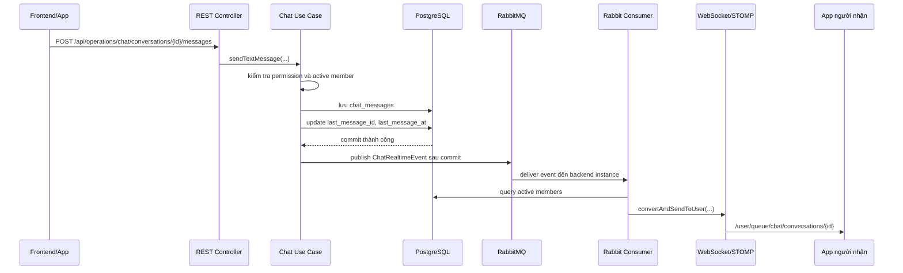

# WebSocket trong tính năng chat realtime

Tài liệu này giải thích WebSocket theo góc nhìn người mới, sau đó nối khái niệm đó với các file đang có trong dự án `vehicle-management`.

Mục tiêu: sau khi đọc xong, bạn hiểu vì sao chat cần WebSocket, RabbitMQ nằm ở đâu trong luồng, file nào làm nhiệm vụ gì, và frontend/app nên phản ứng như thế nào khi nhận realtime event.

## 1. WebSocket là gì?

WebSocket là một kết nối hai chiều, giữ mở lâu dài giữa client và server.

Nếu REST API giống như:

```text
Client hỏi -> Server trả lời -> kết nối kết thúc
```

thì WebSocket giống như:

```text
Client mở một đường dây -> Server và client có thể gửi dữ liệu qua lại bất cứ lúc nào
```

Trong REST thông thường, server không tự chủ động gọi client. Client phải tự gọi API để hỏi: "Có tin nhắn mới chưa?".

Trong WebSocket, server có thể chủ động đẩy tín hiệu về client ngay khi có sự kiện mới, ví dụ: có tin nhắn chat mới.

## 2. Vì sao chat nên dùng WebSocket?

Chat là nghiệp vụ cần phản hồi gần như tức thì.

Ví dụ thực tế trong hệ thống vehicle:

- Nhân viên A gửi tin nhắn cho nhân viên B: "Xe biển số 60K8-2301 đang cần kiểm tra vé tháng".
- Khách hàng gửi ảnh biên lai hoặc ảnh xe bị trầy.
- Nhân viên hỗ trợ gửi phản hồi cho khách hàng.
- Quản lý cần thấy inbox support có cuộc hội thoại mới.

Nếu dùng REST đơn thuần, app của người nhận không biết ngay khi có tin nhắn mới. App phải liên tục gọi API, ví dụ mỗi 2 giây:

```http
GET /api/operations/chat/conversations
GET /api/operations/chat/conversations/{conversationId}/messages
```

Cách đó gọi là polling.

Polling có vài vấn đề:

- Tin nhắn không thật sự realtime, vì phải đợi lần poll tiếp theo.
- Tốn request, tốn CPU, tốn database query.
- Khi nhiều user online, server bị tải bởi rất nhiều request chỉ để hỏi "có gì mới không?".
- App mobile tốn pin và network hơn.
- UX chat kém tự nhiên, người dùng thấy tin nhắn chậm hoặc phải refresh.

WebSocket giải quyết bằng cách: khi server biết có message mới, server đẩy event ngay cho user liên quan.

## 3. WebSocket không thay thế database và REST

Điểm rất quan trọng: WebSocket không phải nguồn sự thật.

Trong dự án này:

- PostgreSQL là nơi lưu dữ liệu thật.
- REST API là nơi client lấy dữ liệu đầy đủ.
- WebSocket chỉ là kênh thông báo nhanh rằng "có thay đổi mới".

Vì vậy khi app nhận WebSocket event, app nên gọi lại REST để lấy dữ liệu đầy đủ nếu cần.

Ví dụ event chỉ chứa:

```json
{
  "conversationId": "uuid",
  "messageId": "uuid",
  "occurredAt": "2026-07-05T10:15:30Z"
}
```

App nhận event xong có thể gọi:

```http
GET /api/operations/chat/conversations/{conversationId}/messages
```

hoặc refresh inbox:

```http
GET /api/operations/chat/conversations
```

Thiết kế này an toàn hơn vì nếu user offline, reload trang, hoặc WebSocket bị rớt tạm thời thì dữ liệu vẫn còn trong database.

## 4. RabbitMQ nằm ở đâu?

RabbitMQ không phải kênh để frontend kết nối trực tiếp.

Trong thiết kế này:

- Frontend/app kết nối WebSocket với backend.
- Backend publish event vào RabbitMQ.
- Các backend instance consume event từ RabbitMQ.
- Backend dùng WebSocket để đẩy event đến user đang kết nối.

Tại sao cần RabbitMQ nếu đã có WebSocket?

Vì production có thể chạy nhiều backend instance.

Ví dụ:

```text
User A đang kết nối WebSocket vào backend instance 1.
User B gửi tin nhắn qua backend instance 2.
```

Nếu instance 2 chỉ đẩy WebSocket trong memory của chính nó, instance 1 sẽ không biết có tin nhắn mới để đẩy cho User A.

RabbitMQ giúp các instance cùng nhận được event:

```text
Instance 2 lưu message -> publish RabbitMQ
RabbitMQ fanout event -> instance 1, instance 2, instance 3
Instance nào đang giữ WebSocket của user thì đẩy event cho user đó
```

## 5. Luồng tổng thể trong dự án

Luồng đang được triển khai:

```text
Frontend gọi REST gửi message
-> Backend validate quyền và member
-> Backend lưu message vào PostgreSQL
-> Transaction commit thành công
-> Backend publish ChatRealtimeEvent vào RabbitMQ
-> Backend instance consume RabbitMQ event
-> Backend query active members của conversation
-> Backend đẩy WebSocket event đến từng user
-> Frontend nhận event và refresh inbox/history nếu cần
```

Sơ đồ:



## 6. Các dependency liên quan

File:

```text
pom.xml
```

Dependency WebSocket:

```xml
<artifactId>spring-boot-starter-websocket</artifactId>
```

Dependency RabbitMQ/AMQP:

```xml
<artifactId>spring-boot-starter-amqp</artifactId>
```

Ý nghĩa:

- `spring-boot-starter-websocket`: bật WebSocket/STOMP trong Spring.
- `spring-boot-starter-amqp`: dùng RabbitMQ, `RabbitTemplate`, `@RabbitListener`, exchange, queue, binding.

## 7. File cấu hình WebSocket

File:

```text
src/main/java/com/ban/vehicle_management/infrastructure/realtime/chat/ChatWebSocketConfig.java
```

Nhiệm vụ: khai báo server hỗ trợ WebSocket/STOMP.

Các phần chính:

```java
@EnableWebSocketMessageBroker
```

Bật cơ chế WebSocket message broker của Spring.

```java
registry.enableSimpleBroker("/topic", "/queue");
```

Bật broker đơn giản trong memory để backend có thể gửi message tới các destination bắt đầu bằng:

- `/topic`
- `/queue`

Trong dự án này:

- `/topic` dùng cho kiểu broadcast/update chung theo user.
- `/queue` dùng cho message riêng theo conversation/user.

```java
registry.setApplicationDestinationPrefixes("/app");
```

Khai báo prefix cho message client gửi lên backend qua WebSocket.

Ví dụ tương lai nếu có endpoint WebSocket gửi message:

```text
/app/chat/conversations/{conversationId}/messages
```

Hiện tại Phase 1 vẫn gửi message qua REST, chưa dùng WebSocket để nhận message từ client.

```java
registry.setUserDestinationPrefix("/user");
```

Khai báo prefix để gửi message riêng cho từng user.

Khi backend gọi:

```java
convertAndSendToUser(accountId, "/queue/chat/conversations/{conversationId}", event)
```

client sẽ subscribe:

```text
/user/queue/chat/conversations/{conversationId}
```

```java
registry.addEndpoint("/ws")
        .setAllowedOriginPatterns("*");
```

Khai báo endpoint để client mở kết nối WebSocket:

```text
ws://localhost:8080/ws
```

hoặc nếu chạy HTTPS:

```text
wss://domain/ws
```

Lưu ý bảo mật: `setAllowedOriginPatterns("*")` tiện cho dev, nhưng production nên giới hạn domain frontend thật.

## 8. File cấu hình RabbitMQ cho realtime chat

File:

```text
src/main/java/com/ban/vehicle_management/infrastructure/realtime/chat/ChatRealtimeRabbitConfig.java
```

Nhiệm vụ: khai báo exchange, queue, binding cho realtime chat.

```java
@EnableRabbit
```

Bật cơ chế `@RabbitListener`.

```java
new TopicExchange(exchangeName, true, false)
```

Tạo topic exchange.

Mặc định:

```text
chat.realtime.exchange
```

Ý nghĩa:

- `true`: durable, RabbitMQ restart vẫn giữ exchange.
- `false`: không tự xóa.

```java
@Value("${app.chat.realtime.routing-key:chat.realtime}")
```

Routing key mặc định:

```text
chat.realtime
```

```java
return new AnonymousQueue();
```

Nếu không cấu hình queue name, mỗi backend instance tạo một queue riêng.

Điều này quan trọng cho multi-instance:

- Instance 1 có queue riêng.
- Instance 2 có queue riêng.
- Instance 3 có queue riêng.

Khi RabbitMQ có event, mỗi instance đều nhận được một bản copy để đẩy WebSocket cho user đang kết nối với instance đó.

Nếu dùng một queue cố định cho mọi instance, RabbitMQ sẽ chia tải event, có thể chỉ một instance nhận được. Khi đó user đang nối vào instance khác có thể không được đẩy realtime.

```java
BindingBuilder.bind(chatRealtimeQueue)
        .to(chatRealtimeExchange)
        .with(routingKey);
```

Nối queue vào exchange bằng routing key.

## 9. File publish event vào RabbitMQ

File:

```text
src/main/java/com/ban/vehicle_management/infrastructure/realtime/chat/ChatRealtimeRabbitPublisherAdapter.java
```

Nhiệm vụ: nhận event từ application layer và publish vào RabbitMQ.

Class này implement port:

```text
ChatRealtimeEventPublisherPortOut
```

Điều này giữ đúng Clean Architecture:

- Application layer chỉ biết port.
- Infrastructure layer biết RabbitMQ thật.

Đoạn chính:

```java
rabbitTemplate.convertAndSend(exchangeName, routingKey, event);
```

Ý nghĩa:

- Gửi `ChatRealtimeEvent` vào exchange.
- RabbitMQ dựa vào routing key để đưa event tới queue phù hợp.

Trong catch:

```java
LOGGER.warn("Failed to publish chat realtime event {}", event, exception);
```

Nếu RabbitMQ lỗi, hệ thống chỉ log warning.

Lý do: message đã lưu trong database rồi. Realtime có thể miss tạm thời, nhưng REST history vẫn khôi phục được. Đây là thiết kế ưu tiên không làm mất dữ liệu chat.

## 10. File consume RabbitMQ và đẩy WebSocket

File:

```text
src/main/java/com/ban/vehicle_management/infrastructure/realtime/chat/ChatRealtimeRabbitConsumer.java
```

Nhiệm vụ: nhận event từ RabbitMQ, tìm người cần nhận, rồi đẩy WebSocket tới từng user.

Đoạn nhận event:

```java
@RabbitListener(queues = "#{chatRealtimeQueue.name}")
public void handle(ChatRealtimeEvent event)
```

Ý nghĩa:

- Lắng nghe queue đã tạo trong `ChatRealtimeRabbitConfig`.
- Khi RabbitMQ có event, method `handle` được gọi.

Sau đó query active members:

```java
memberRepository.findActiveMemberAccountIds(event.conversationId())
```

Điều này đảm bảo chỉ member đang active trong conversation mới nhận realtime.

Sau đó gửi WebSocket:

```java
messagingTemplate.convertAndSendToUser(
        user,
        "/queue/chat/conversations/" + event.conversationId(),
        event
);
```

Với `user = accountId.toString()`.

Client subscribe:

```text
/user/queue/chat/conversations/{conversationId}
```

Ngoài ra còn gửi inbox update:

```java
messagingTemplate.convertAndSendToUser(user, "/topic/chat", event);
```

Client subscribe:

```text
/user/topic/chat
```

Nên hiểu như sau:

- `/user/queue/chat/conversations/{conversationId}`: màn hình đang mở conversation cụ thể.
- `/user/topic/chat`: màn hình inbox hoặc badge tổng quan cần biết có cập nhật mới.

## 11. Event realtime gồm những gì?

File:

```text
src/main/java/com/ban/vehicle_management/application/operations/chatconversation/model/ChatRealtimeEvent.java
```

Nội dung:

```java
public record ChatRealtimeEvent(
        UUID conversationId,
        UUID messageId,
        Instant occurredAt
) implements Serializable
```

Event này cố tình gọn:

- `conversationId`: hội thoại nào có thay đổi.
- `messageId`: message mới hoặc message liên quan.
- `occurredAt`: thời điểm phát event.

Không nhét full message vào event để tránh payload lớn, tránh lộ dữ liệu nhạy cảm, và giữ REST là nguồn dữ liệu đầy đủ.

## 12. Vì sao publish sau commit?

File:

```text
src/main/java/com/ban/vehicle_management/shared/transaction/TransactionalEvents.java
```

Trong use case gửi message, dự án gọi:

```java
TransactionalEvents.runAfterCommit(...)
```

Ý nghĩa: chỉ publish RabbitMQ sau khi transaction database commit thành công.

Nếu publish trước commit, có rủi ro:

1. Server gửi realtime event.
2. App người nhận thấy có message mới.
3. App gọi REST history.
4. DB chưa commit hoặc transaction rollback.
5. App không thấy message, gây lệch trạng thái.

Publish sau commit giúp tránh lỗi đó.

## 13. Use case chat gọi realtime ở đâu?

File:

```text
src/main/java/com/ban/vehicle_management/application/operations/chatconversation/usecase/ChatConversationUseCaseImpl.java
```

Gửi text:

```java
sendTextMessage(...)
```

Luồng:

```text
validate quyền
-> validate active member
-> validate content
-> saveMessageAndPublish
-> saveMessageWithoutRealtime
-> publishAfterCommit
```

Gửi ảnh:

```java
sendImageMessage(...)
```

Luồng:

```text
validate quyền upload attachment
-> validate active member
-> validate file ảnh
-> lưu message IMAGE
-> upload MinIO private
-> lưu attachment metadata
-> publishAfterCommit
```

Điểm gọi realtime:

```java
private void publishAfterCommit(ChatMessage message) {
    TransactionalEvents.runAfterCommit(() -> realtimeEventPublisher.publish(new ChatRealtimeEvent(
            message.getConversationId(),
            message.getMessageId(),
            Instant.now()
    )));
}
```

Application layer không biết RabbitMQ. Nó chỉ gọi `realtimeEventPublisher`, là một port. RabbitMQ thật nằm ở infrastructure adapter.

## 14. Frontend nên dùng như thế nào?

Khi mở app:

1. Gọi REST lấy inbox:

```http
GET /api/operations/chat/conversations
```

2. Kết nối WebSocket:

```text
/ws
```

3. Subscribe inbox update:

```text
/user/topic/chat
```

4. Khi mở một conversation, subscribe:

```text
/user/queue/chat/conversations/{conversationId}
```

5. Khi nhận event:

```json
{
  "conversationId": "...",
  "messageId": "...",
  "occurredAt": "..."
}
```

Nếu đang ở màn conversation đó:

```http
GET /api/operations/chat/conversations/{conversationId}/messages
```

Nếu đang ở inbox:

```http
GET /api/operations/chat/conversations
```

## 15. Nếu không dùng WebSocket thì ảnh hưởng gì?

Nếu không dùng WebSocket, hệ thống vẫn có thể chat bằng REST, nhưng sẽ không realtime tự nhiên.

Các phương án thay thế và ảnh hưởng:

### 15.1 Polling

Client gọi API liên tục.

Ví dụ mỗi 2 giây:

```http
GET /api/operations/chat/conversations
```

Vấn đề:

- Nhiều request vô ích khi không có message mới.
- Tăng tải backend và database.
- Tốn pin mobile.
- Message vẫn có độ trễ.

### 15.2 Long polling

Client gọi request và server giữ request lâu cho đến khi có dữ liệu mới.

Tốt hơn polling thường, nhưng:

- Server phải giữ nhiều request mở.
- Phức tạp hơn REST thường.
- Vẫn không tiện bằng WebSocket cho chat hai chiều.

### 15.3 Chỉ refresh thủ công

Người dùng phải kéo refresh hoặc app reload.

Vấn đề:

- UX rất kém.
- Dễ bỏ lỡ support request khẩn cấp.
- Không phù hợp với chat nội bộ vận hành bãi xe.

## 16. Vì sao không gửi full message qua WebSocket luôn?

Có thể làm, nhưng Phase 1 đang chọn hướng an toàn hơn.

Lý do:

- Message có thể có attachment private.
- Có dữ liệu nhạy cảm như biển số, ảnh xe, ảnh biên lai.
- Permission và member có thể thay đổi.
- REST response đã có mapper riêng để ẩn field nội bộ.
- Event nhỏ giúp RabbitMQ nhẹ hơn.

Vì vậy WebSocket chỉ báo:

```text
conversation X có message Y mới
```

App muốn hiển thị đầy đủ thì gọi REST.

## 17. Tổng kết dễ nhớ

Trong dự án này:

```text
REST = nơi user tạo hành động và lấy dữ liệu đầy đủ
PostgreSQL = nguồn sự thật
RabbitMQ = kênh phát event giữa các backend instance
WebSocket = kênh đẩy realtime từ backend đến app
App = nhận event rồi refresh dữ liệu cần hiển thị
```

Luồng chuẩn:

```text
Gửi message
-> Lưu DB
-> Commit
-> Publish RabbitMQ
-> Consume RabbitMQ
-> Query active members
-> Push WebSocket theo từng user
-> App refresh inbox/history
```

Nếu nhớ được câu này là đã nắm lõi thiết kế realtime chat trong project.
